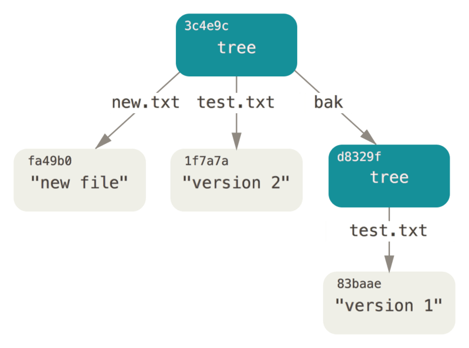
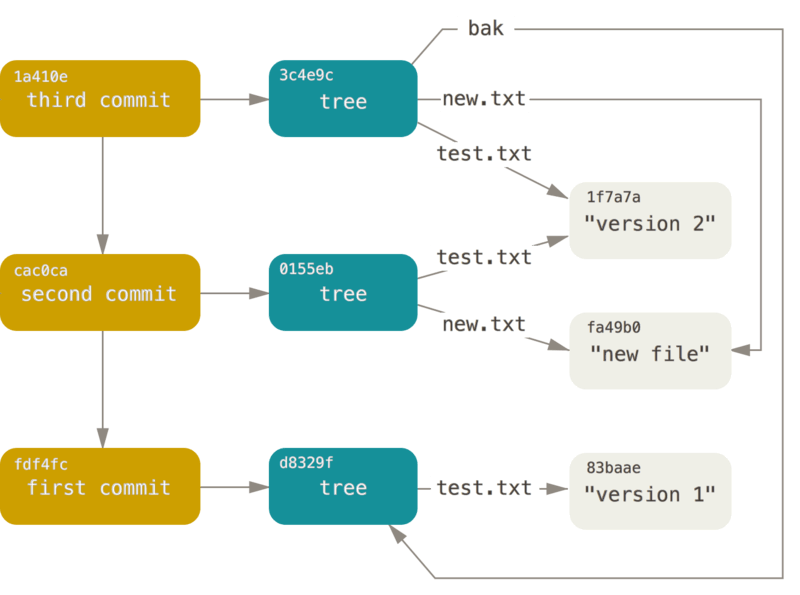

# Git 原理
文章就基于git官方文档的学习笔记，并记录一下在看文档的时候的实验过程，git实验的版本是 git version 2.42.0.windows.1；

如果内容有问题或者不正确的地方，欢迎留言讨论。

## git初始目录

在执行完git init后，.git目录中包含以下文件

- hooks 用于存放钩子脚本的目录
- description 用于GitWeb程序使用，文档上说这边不需要关系，那就先跳过
- config 项目特有的配置信息
- info 这个目录包含所有不希望记录在.gitignore又需要被忽略的文件

下面四个是比较重要的文件
- HEAD 该文件指向目前所在的分支
- index 文件保存暂存区的信息，这个文件在init之初是未被创建的
- objects 存储所有的数据信息
- refs 存储指向数据的指针


## 数据对象
git的核心部分可以认为是一个key-vlaue的数据库，在git init初始化的时候，git在objects中创建了两个空的目录，分别是info 和 pack；

跟这文档，执行下述命令后，返回一个长度40的校验和
```
echo "test first" | git hash-object -w --stdin
d50b0140c9fbe1aa26e7e28abf6f3c4ea9cde9ea
```
这个检验和是SHA-1哈希值，通过要存储的信息和一个header信息做SHA-1校验得到的运算结果。

命令执行完毕之后，可以看到objects中多了对应的d5文件夹和0b0140c9fbe1aa26e7e28abf6f3c4ea9cde9ea的文件；可以分析出是用校验和的前两个字符作用目录名，后面38个在字符作为文件名。

通过下述命令可以从“git数据库”中得到返回对应的内容
```
$ git cat-file -p d50b0140c9fbe1aa26e7e28abf6f3c4ea9cde9ea
test first
```

跟着官网的文档，继续使用git hash-object -w往git数据库插入一些数据
```
$ echo "version 1" > test.txt

$ git hash-object -w test.txt
83baae61804e65cc73a7201a7252750c76066a30

$ find .git/objects/ -type f
.git/objects/83/baae61804e65cc73a7201a7252750c76066a30
.git/objects/d5/0b0140c9fbe1aa26e7e28abf6f3c4ea9cde9ea


echo "version 2" > test.txt
$ git hash-object -w test.txt
1f7a7a472abf3dd9643fd615f6da379c4acb3e3a

$ find .git/objects -type f
.git/objects/1f/7a7a472abf3dd9643fd615f6da379c4acb3e3a
.git/objects/83/baae61804e65cc73a7201a7252750c76066a30
.git/objects/d5/0b0140c9fbe1aa26e7e28abf6f3c4ea9cde9ea
```

使用这个方式插入数据的时候，可以看到git status等正常方式是不会有改变的
```
$ git status
On branch master

No commits yet

Untracked files:
  (use "git add <file>..." to include in what will be committed)
        test.txt
```
这种方式直接通过git hash-object -w插入的数被称为 数据对象（blob objects），它没有存储对应的文件名字等信息

通过git cat-file -t 命令可以看到git存储的内部对象类型
```
$ git cat-file -t 1f7a7a472abf3dd9643fd615f6da379c4acb3e3a
blob
```

## 树对象

树对象的存在是为了解决数据对象中没有名字的问题；

使用下面的一系列命令创建出一个树对象

首先是提交文件到暂存区
```
$ git update-index --add --cacheinfo 100644 83baae61804e65cc73a7201a7252750c76066a30 test.txt
```
其中
- --add是因为这个文件需要首次加入到暂存区；
- --cacheinfo 是因为对应的对象是在之前加入到git 数据库中的，而不是目录下的文件；
- 100644 表明加入的是一个普通文件，其他还有选项如10755之类的，具体看官网
- test.txt是文件名；

提交完毕后通过git write-tree 来创建出对应的树对象
```
$ git write-tree 83baae61804e65cc73a7201a7252750c76066a30
d8329fc1cc938780ffdd9f94e0d364e0ea74f579

$ git cat-file -p d8329fc1cc938780ffdd9f94e0d364e0ea74f579
100644 blob 83baae61804e65cc73a7201a7252750c76066a30    test.txt

$ git cat-file -t d8329fc1cc938780ffdd9f94e0d364e0ea74f579
tree
```
可以看到这个树对象的内容就是之前输入到暂存区的参数；


接下来跟着官网实例为test.txt创建新的版本，和新的文件

```
$ git update-index --add --cacheinfo 100644 1f7a7a472abf3dd9643fd615f6da379c4acb3e3a test.txt
$ echo "new file" > new.txt
$ git update-index --add new.txt

$ git write-tree
0155eb4229851634a0f03eb265b69f5a2d56f341

$ git cat-file -p 0155eb4229851634a0f03eb265b69f5a2d56f341
100644 blob fa49b077972391ad58037050f2a75f74e3671e92    new.txt
100644 blob 1f7a7a472abf3dd9643fd615f6da379c4acb3e3a    test.txt
```
在这次的提交中，可以看到生成的树对象内容包含了这次的修改的数据对象指针以及文件内容

将之前的树节点读取出来然后提交
```
$ git read-tree --prefix=bak d8329fc1cc938780ffdd9f94e0d364e0ea74f579
$ git write-tree
3c4e9cd789d88d8d89c1073707c3585e41b0e614
$ git cat-file -p 3c4e9cd789d88d8d89c1073707c3585e41b0e614
040000 tree d8329fc1cc938780ffdd9f94e0d364e0ea74f579      bak
100644 blob fa49b077972391ad58037050f2a75f74e3671e92      new.txt
100644 blob 1f7a7a472abf3dd9643fd615f6da379c4acb3e3a      test.txt
```


到这边我才发现，我的SHA-1内容和官方示例是一样的，不过也确实，因为校验和是根据内容生成的，内容一致，所以结果也一样。

做到这边我的疑惑是为什么第三步读入树对象了之后，在git write-tree之后会有new.txt和test.txt；我这边以为git write-tree是对应git commit， 会将暂存区清空的；但后面发现官网文档上有说明git write-tree 只是将当前暂存区对象打包成一个树对象，不会改成暂存区；


## 提交对象

提交对象的目的是为了保存什么时候、为什么提交快照信息；

```
$ echo "first commit" | git commit-tree d8329fc1cc938780ffdd9f94e0d364e0ea74f579
3d892437b4885956efeece70e6264534b1aa1785

```
文档还很贴切的在这提示了说因为时间不同，得到的会是不同的SHA-1值

```
$ git cat-file -p fdf4fc3
tree d8329fc1cc938780ffdd9f94e0d364e0ea74f579
author Scott Chacon <schacon@gmail.com> 1243040974 -0700
committer Scott Chacon <schacon@gmail.com> 1243040974 -0700

first commit
```
这边按文档的例子来解释，提交对象的头部是一个树对象的SHA, 然后是作者信息，最后是提交注释

通过git log --stat <SHA-1> 就可以看到一个完整的提交记录

如果继续把上述的树对象都提交了，后续的提交需要指定前一个提交作为父对象
```
$ echo 'second commit' | git commit-tree 0155eb -p 3d892437
80869a3e49b9078e1152d6ab8cf14b332e0cac69

$ echo 'third commit'  | git commit-tree 3c4e9c -p 80869a3e
55ab56f172e9224cc3ed302ff7f74da514d27e11
```
最后的结果应该是和文档的图是一致的



## 对象存储

git对象的SHA-1 是通过一个header + content组成的；

content就是文档内容，而header是通过content的类型和长度生成的，最后将header + content拼接在一起后进行SHA-1得到最后的校验合。
而content在存储之前会经过zlib压缩。

最后存储到文件的时候就是SHA-1作为文件名，zlib压缩的content作为文件内容


## 引用
1. https://git-scm.com/book/zh/v2/Git-%E5%86%85%E9%83%A8%E5%8E%9F%E7%90%86-%E5%BA%95%E5%B1%82%E5%91%BD%E4%BB%A4%E4%B8%8E%E4%B8%8A%E5%B1%82%E5%91%BD%E4%BB%A4
2. https://git-scm.com/book/zh/v2/Git-%E5%86%85%E9%83%A8%E5%8E%9F%E7%90%86-Git-%E5%AF%B9%E8%B1%A1 


