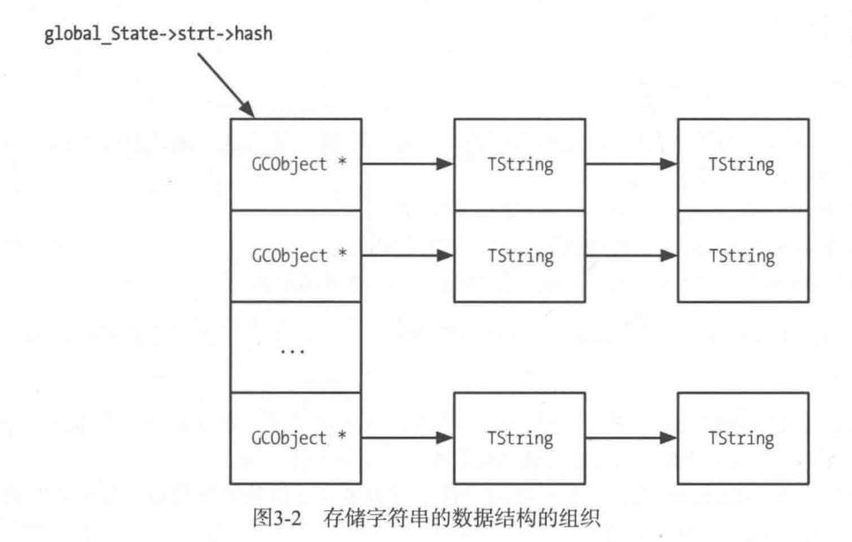

# Lua 源码阅读笔记-String
lua版本基于5.4.6， 文章更多是记录自己在阅读的是思绪，而非科普。

很多源码比较长，直接贴不太好，建议阅读时配合着源码一起。

如果内容有问题或者不正确的地方，欢迎留言讨论。

## Lua的String

lua String 的代码很少， 相关的代码加起来也才几百行吧。

首先是字符串类型的定义
```
/*
** Header for a string value.
*/
typedef struct TString {
  CommonHeader;
  lu_byte extra;  /* reserved words for short strings; "has hash" for longs */
  lu_byte shrlen;  /* length for short strings */
  unsigned int hash;
  union {
    size_t lnglen;  /* length for long strings */
    struct TString *hnext;  /* linked list for hash table */
  } u;
  char contents[1];
} TString;
```

- extra 在短字符串中目前是用来判断是否是关键字，在长字符串中作为是否有hash值的标记
- shrlen 短字符串的长度
- hash hash值
- u 长字符串是用做长度，短字符串是用作哈希表的链接
- contents 存字符串的地方，用了个柔性数组，在申请的内存时候，字符串对应的位置可以一并申请并放在末尾。


extra 在短字符串中标记的位置是在luaX_init函数(llex.c)中

## luaS_new
这个函数在看起来是字符串创建的入口， 代码不长
```
TString *luaS_new (lua_State *L, const char *str) {
  unsigned int i = point2uint(str) % STRCACHE_N;  /* hash */
  int j;
  TString **p = G(L)->strcache[i];
  for (j = 0; j < STRCACHE_M; j++) {
    if (strcmp(str, getstr(p[j])) == 0)  /* hit? */
      return p[j];  /* that is it */
  }
  /* normal route */
  for (j = STRCACHE_M - 1; j > 0; j--)
    p[j] = p[j - 1];  /* move out last element */
  /* new element is first in the list */
  p[0] = luaS_newlstr(L, str, strlen(str));
  return p[0];
}
```
可以看到在用这个接口生成字符串的时候，会先判断字符串地址是否在cache中，如果在的话，直接返回cache的对象，否则在缓存头部插入这个对象；STRCACHE_M是hash桶的大小，如果超过大小则会踢掉最后一个元素。


## luaS_newlstr 创建字符串的函数

```
TString *luaS_newlstr (lua_State *L, const char *str, size_t l) {
  if (l <= LUAI_MAXSHORTLEN)  /* short string? */
    return internshrstr(L, str, l);
  else {
    TString *ts;
    if (l_unlikely(l >= (MAX_SIZE - sizeof(TString))/sizeof(char)))
      luaM_toobig(L);
    ts = luaS_createlngstrobj(L, l);
    memcpy(getstr(ts), str, l * sizeof(char));
    return ts;
  }
}
```

这边看LUA 默认的短字符串长度为40（宏为 LUAI_MAXSHORTLEN），短字符串会通过internshrstr来创建字符串对象；而超过短长度限制的会通过luaS_createlngstrobj来创建对应的字符串对象，并赋值到content中。

## internshrstr 

internshrstr 函数可以分成3个部分
1. 首先是根据全局共享的global_State获取到对应的stringtable，这个stringtable相当于字符串的哈希表。然后算出对应字符串的hash值。
2. 在stringtable中查找是否有对应的字符串，有的话直接服用；这边又一个特殊一点的，就是如果找到的字符串已经没人被其他地方引用，但还没被GC回收的话，那么也会直接让对象复活。
3. 到这边就确定是必须创建的字符串对象，那么就申请空间，赋值content，然后判断对应的stringtable是不是要扩容了，最后插入到stringtable中，并返回。

## luaS_createlngstrobj

超长的对象不会进入stringtable，直接申请空间赋值就结束了。他们申请空间走的都是createstrobj这个接口，但有几个不同的点

- 短字符串的tag是LUA_VSHRSTR， 而长字符串的tag是LUA_VLNGSTR。
- 短字符串是用shrlen表示长度，而长字符串是用lnglen来表示长度
- 长字符串在申请的时候确实没填充hash、shrlen、extra，


这边感觉到LUA对短字符串的内存使用有使用一些优化的手段；而对于不太常用的长字符串的话，貌似会浪费一些字段，但也不是特别要紧。

## growstrtab & luaS_resize
growstrtab 和 luaS_resize 实际上都是为了调用tablerehash的。

growstrtab函数在internshrstr中会用到，主要是在第三步扩容的位置使用。

luaS_resize的代码主要分为两种情况
- 当是缩容的情况，luaS_resize先执行一遍tablerehash，然后在申请新内存（看完后面的tablerehash，感觉缩容不应该会改变内存），如果申请失败则恢复。
- 当是扩容的情况，只有申请成功了之后才会操作。


## tablerehash
tablerehash的代码感觉有点意思的，是在本地上进行的rehash。有点不同于python、stl之类的方式，它们的方式是先申请一个表，然后for循环当前的hash表，将元素在新表上找到位置后一个个搬迁过去。而lua的实现如下

```
static void tablerehash (TString **vect, int osize, int nsize) {
  int i;
  for (i = osize; i < nsize; i++)  /* clear new elements */
    vect[i] = NULL;
  for (i = 0; i < osize; i++) {  /* rehash old part of the array */
    TString *p = vect[i];
    vect[i] = NULL;
    while (p) {  /* for each string in the list */
      TString *hnext = p->u.hnext;  /* save next */
      unsigned int h = lmod(p->hash, nsize);  /* new position */
      p->u.hnext = vect[h];  /* chain it into array */
      vect[h] = p;
      p = hnext;
    }
  }
}
```
lua的这个tablerehash 主要执行的步骤如下：
1. 如果是扩容，则将新生长的部分清空。
2. 遍历原来的长度的数据，将原来长度中的元素按新大小进行hash找到位置放到链表头部。

乍一看这个代码会想到两个问题
1. 元素被重新映射到当前位置，构成死循环？
2. 是否会出现重新映射后的元素后面再次遍历到？即新的元素位置还是小于osize？

但实际上上面的问题都不会存在。先来解释第一个情况，因为在遍历到vect[i]的时候，把vect[i]的元素设置成NULL了，相当于先把链表和hash表分离了。所以即使在同一个位置，也不会构成死循环。

第二个问题，则需要考虑到LUA的这个表的扩容和缩容一定是以2的倍数进行的。也就是扩大一定是扩大2倍，缩小也一定缩小到原来的1/2，这边在源码中可以搜索到调用luaS_resize的位置只有2处。

假设原来的大小是4，扩容后的大小是8。原来映射到0号位置的元素，被rehash后，出现的位置一定是0和4，同理原来1号位置的元素会被映射到1和5。而rehash的范围是0~3,所以不可能出现rehash后元素的位置会小于osize且不为i的。

这个实现方式的好处感觉在于就是可以不必频繁的变动内存位置，减少申请内存的次数。扩缩容的时候可以预留一部分内存，等真正不够用的时候在去申请更大的内存块。

## 总结

字符串对象的实现确实都差不多，相比于Python 来说确实会更加轻量化一点。同时也看得出来LUA的字符串是不考虑编码格式的问题。tablerehash的方式和Redis的字典扩容的方式应该可以算是一致的。



同样的，图例的GCObject应该修改成CommonHeader。


## 引用
1. 《Lua设计与实现》


