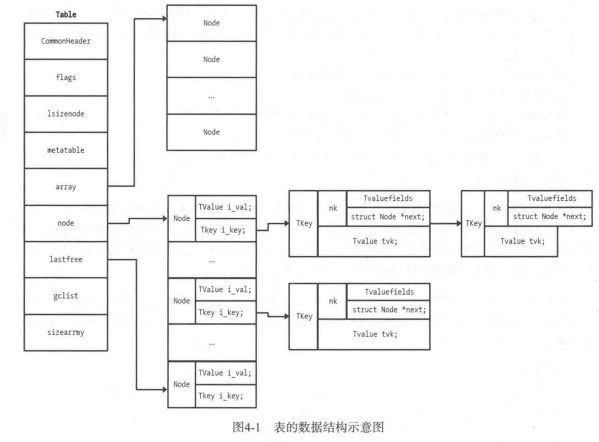

# Lua 源码阅读笔记-Table
lua版本基于5.4.6， 文章更多是记录自己在阅读的是思绪，而非科普。

很多源码比较长，直接贴不太好，建议阅读时配合着源码一起。

如果内容有问题或者不正确的地方，欢迎留言讨论。

## Lua的Table

Lua的table 比较灵活，可以同时作为数组和字典，在内部实现上实际是有区分这两个类型的。

首先看一下Table的基本结构
```
typedef struct Table {
  CommonHeader;
  lu_byte flags;  /* 1<<p means tagmethod(p) is not present */
  lu_byte lsizenode;  /* log2 of size of 'node' array */
  unsigned int alimit;  /* "limit" of 'array' array */
  TValue *array;  /* array part */
  Node *node;
  Node *lastfree;  /* any free position is before this position */
  struct Table *metatable;
  GCObject *gclist;
} Table;
```

flags
lsizenode: log2(字典大小) 的结果， 这边也还说明作为字典的时候，大小一定是2的倍数
alimit:  看起来是数组的大小，但不一定时准确的数组大小
array： 当table是数组时，指向使用的内存位置
node: 当table是字典时，指向使用的内存位置
lastfree: 当table刚申请的时候，指向table的末尾，冲突时会向前移动这个指针，找到一个空闲的位置

metatable: 指向这个表的原表
gclist: gc相关链表


```
typedef struct TValue {
  TValuefields;
} TValue;

typedef union Node {
  struct NodeKey {
    TValuefields;  /* fields for value */
    lu_byte key_tt;  /* key type */
    int next;  /* for chaining */
    Value key_val;  /* key value */
  } u;
  TValue i_val;  /* direct access to node's value as a proper 'TValue' */
} Node;
```

node 对象的组成实际上就是NodeKey， 虽然整个Node是union标识的，但实际上NodeKey这个结构体的第一个字段和TValue 是一样的，所以i_val只是一个快速访问node中value的字段的方式。

回到NodeKey上面，NodeKey由以下字段组成
- TValuefields 存储value的类型和值(或者指针)
- key_tt key的类型
- key_val key 的值
- next hash冲突时使用链表来解决。



这边附上《lua设计与实现》 一书中的对于表结构的图，注意书中是LUA5.1的结构，我阅读的时LUA5.4稍微有点区别，但基本类似, 图方便没有自己画图。

# table 的搜索 
先看以下对于一个table，lua是怎么尝试找到对应的值的。

```
/*
** main search function
*/
const TValue *luaH_get (Table *t, const TValue *key) {
  switch (ttypetag(key)) {
    case LUA_VSHRSTR: return luaH_getshortstr(t, tsvalue(key));
    case LUA_VNUMINT: return luaH_getint(t, ivalue(key));
    case LUA_VNIL: return &absentkey;
    case LUA_VNUMFLT: {
      lua_Integer k;
      if (luaV_flttointeger(fltvalue(key), &k, F2Ieq)) /* integral index? */
        return luaH_getint(t, k);  /* use specialized version */
      /* else... */
    }  /* FALLTHROUGH */
    default:
      return getgeneric(t, key, 0);
  }
}
```

对于一个table和一个指定的key，会根据key的类型来决定调用什么方式搜索；
- 当key 是short str的时候，会调用luaH_getshortstr
- 当key 是int 或者是 等于整数的float的时候，会调用luaH_getint
- 当key 是nil的时候，直接返回absentkey（不存在的key
- 其他情况调用getgeneric

## luaH_getshortstr
```
const TValue *luaH_getshortstr (Table *t, TString *key) {
  Node *n = hashstr(t, key);
  lua_assert(key->tt == LUA_VSHRSTR);
  for (;;) {  /* check whether 'key' is somewhere in the chain */
    if (keyisshrstr(n) && eqshrstr(keystrval(n), key))
      return gval(n);  /* that's it */
    else {
      int nx = gnext(n);
      if (nx == 0)
        return &absentkey;  /* not found */
      n += nx;
    }
  }
}
```
获取字符串的hash值，然后判断对应的node是不是short str类型 且是否和key相等，相等则返回对应的value；不是的话则通过next字段找到下一个node。这边看方式next存的不是下一个node的指针，而是偏移。


## luaH_getint
这个函数的步骤大概如下：
1. 确认key的范围是不是在数组大小内，即 0< key < alimit, 如果是则直接返回array[key - 1]
2. 如果alimit不是真实的数组长度，且key是在真实范围内的话，则也直接返回array[key - 1](这边不是真实的数组长度原因好像是因为数组中包含了nil)
3. 尝试用字典的方式在搜索一波key。
4. 都失败了则返回absentkey。

## getgeneric
```
static const TValue *getgeneric (Table *t, const TValue *key, int deadok) {
  Node *n = mainpositionTV(t, key);
  for (;;) {  /* check whether 'key' is somewhere in the chain */
    if (equalkey(key, n, deadok))
      return gval(n);  /* that's it */
    else {
      int nx = gnext(n);
      if (nx == 0)
        return &absentkey;  /* not found */
      n += nx;
    }
  }
}
```
getgeneric 函数就是完全将table当作hash表来进行搜索了。搜索代码上和short hash 基本一样的，先通过mainpositionTV获取key的第一个位置，然后通过这个位置不断的在table中寻找匹配的key。

mainpositionTV 中会通过key的类型来获取对应的hash值。

# table的插入
table 插入的入口看起来是luaH_set
```
void luaH_set (lua_State *L, Table *t, const TValue *key, TValue *value) {
  const TValue *slot = luaH_get(t, key);
  luaH_finishset(L, t, key, slot, value);
}
```
整个函数就2行，找到一个key，然后设置成对应的value
## luaH_finishset
```
void luaH_finishset (lua_State *L, Table *t, const TValue *key,
                                   const TValue *slot, TValue *value) {
  if (isabstkey(slot))
    luaH_newkey(L, t, key, value);
  else
    setobj2t(L, cast(TValue *, slot), value);
}
``` 
在luaH_finishset中，如果slot查找出来是absentkey，则会调用luaH_newkey创建新的key，不然就直接设置value即可。

luaH_newkey 函数比较长，建议对照源码来看.

1. 首先先要确认key和value 的类型，当key或者value为nil的时候，是不允许插入的。如果key是float且能转成int 的话，则key会被当做int进行插入。
2. 通过mainpositionTV来找到对应的node
3. 如果发现需要扩容，则执行rehash，然后递归重新执行luaH_set。
4. 如果找到的node已经有数据的话，则通过这步找到一个新的位置；
5. 将找到的node的key和value都设置好。


这边的第3、4步代码如下：
```
  mp = mainpositionTV(t, key);
  
  // 判断是否冲突或者hash表的lastfree为空
  if (!isempty(gval(mp)) || isdummy(t)) {  /* main position is taken? */

    // 先找一个空位来放这个元素
    // getfreepos 默认都是从内存块的最后往前找一个没元素的位置
    Node *othern;
    Node *f = getfreepos(t);  /* get a free place */
    if (f == NULL) {  /* cannot find a free place? */
      // 没位置了就rehash
      rehash(L, t, key);  /* grow table */
      /* whatever called 'newkey' takes care of TM cache */
      luaH_set(L, t, key, value);  /* insert key into grown table */
      return;
    }
    lua_assert(!isdummy(t));

    // 将碰撞位置的元素进行一次hash来判断这个元素是否应该在这里
    othern = mainpositionfromnode(t, mp);
    if (othern != mp) {  /* is colliding node out of its main position? */
      /* yes; move colliding node into free position */
      // 将碰撞的元素找到一个新的位置插入
      while (othern + gnext(othern) != mp)  /* find previous */
        othern += gnext(othern);
      gnext(othern) = cast_int(f - othern);  /* rechain to point to 'f' */
      *f = *mp;  /* copy colliding node into free pos. (mp->next also goes) */
      // 将新元素插入到原来碰撞元素的位置
      if (gnext(mp) != 0) {
        gnext(f) += cast_int(mp - f);  /* correct 'next' */
        gnext(mp) = 0;  /* now 'mp' is free */
      }
      setempty(gval(mp));
    }
    else {  
      // 碰撞的位置是对应位置上的元素，则将新位置链接到这个元素后面
      /* colliding node is in its own main position */
      /* new node will go into free position */
      if (gnext(mp) != 0)
        gnext(f) = cast_int((mp + gnext(mp)) - f);  /* chain new position */
      else lua_assert(gnext(f) == 0);
      gnext(mp) = cast_int(f - mp);
      mp = f;
    }
  }
```

lua的table和其他dict实现的有点不太一样，以Python为例子，Python的hash表实现是hash表和元素节点的内存是分开的，hash表中存的是元素的链表。但Lua中hash表和元素是共用内存的，即hash表存的就是元素。

而且冲突的时候的处理也挺不一致的。python因为元素内存是额外申请的，所以找到位置后直接修改链表即可。而Lua在冲突的时候，是通过lastfree指针在hash表从后往前找一个空闲的元素位置，然后根据冲突节点来判断这个空闲的位置到底是给新节点还是冲突节点。

感觉这种实现的话，应该是为内存效率做考虑，但代价就是冲突处理的效率肯定是低于其他实现的，同时table删除元素是将对应的value修改成nil来实现的，所以lastfree指针只会不断向前，对于会频繁增删的hash表来说，应该是会造成rehash的次数上涨的。


## rehash
lua table的rehash因为同时包含数组和hash表的，所以在rehash的时候，会同时改变这两个部分的内容。luaH_resize才是真正重新分配内存的地方，而之前的部分都是为了计算出一个新的数组大小和hash表大小。
主要涉及到一下几个变量：
- totaluse 表示所有key的总和
- na表示数字部分的key的总和
- nums 一个统计数组，nums[i] 表示 在 （2^(i - 1)， 2^i]  之间的数字key的个数

这几个变量会在computesizes 中计算出一个合适的新的数组部分大小asize，用来存储数字部分的key。computesizes函数的主要思路应该是算出一个最小的2的N次幂，使得其中数字key在[1, 2^N]的分布能够小于50%。
而剩余的key就会认为应该是在hash表的部分，所以totaluse - asize 就是新的hash表大小。

luaH_resize 就会对这两个新的大小进行内存的重新分配和元素迁移。数组分部申请新的内存，然后直接内存拷贝相同大小部分的数据。hash表部分遍历全表，找到非nil元素进行搬迁，重新调用luaH_set对新table进行插入，这样需要搬迁到数组部分的元素也就会迁移过去了。


## 取长度操作

通过#操作来对table获取长度的操作实际上不是常规意义上的取长度.
'#'操作符通过 luaH_getn 来完成，luaH_getn实际上是返回n，满足a[1]~a[n]所有元素不为空
以下面的代码为例子：
```
a = {4, 5, nil, nil，6}
print(#a)
>> 5  -- 刚创建，所以初始化了数组长度，返回的还是5
a[6] = 1
print(#a) 
>> 2  --多塞入一个，造成了rehash，数组长度需要通过luaH_getn来获得
```
这边就可以看出，只要通过luaH_getn来获取长度，如果数组包含nil，那么获取的结果就不一定是完整的数组的长度。

luaH_getn 实现实际上是通过二分的方式来找满足 a[n - 1] ~= nil and a[n] == nil

这边就不分析具体代码了。

# 总结
通过阅读table的增删查改，感觉到LUA对于table的实现上更注重内存的使用，所带来的代价就是rehash 和冲突解决的消耗变高了。

貌似table默认也不支持取正确的长度，可能在需要table长度的时候需要注意自己维护一下，避免每次都遍历table来获取长度

# 引用
1.《lua设计与实现》
