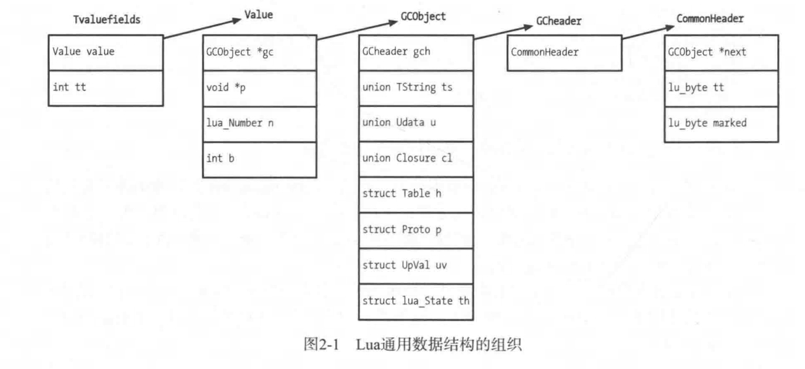

# Lua 源码阅读笔记-基本类型
lua版本基于5.4.6， 文章更多是记录自己在阅读的是思绪，而非科普。
如果内容有问题或者不正确的地方，欢迎留言讨论。

## Lua的基本类型

在Lua中，所有的类型都是通过Value + type的方式进行管理

```
// lobject.h
typedef union Value {
  struct GCObject *gc;    /* collectable objects */
  void *p;         /* light userdata */
  lua_CFunction f; /* light C functions */
  lua_Integer i;   /* integer numbers */
  lua_Number n;    /* float numbers */
  /* not used, but may avoid warnings for uninitialized value */
  lu_byte ub;
} Value;

#define TValuefields	Value value_; lu_byte tt_
typedef struct TValue {
  TValuefields;
} TValue;

```

Tvalue中value_管理对应的值或者指针，而 tt_管理对应的类型, lu_byte实际上是unsigned char。

这边的类型不是用enum之类的来实现的，而是用一系列的宏来标识对应的类型。

```
// lobject.h
/*
** tags for Tagged Values have the following use of bits:
** bits 0-3: actual tag (a LUA_T* constant)
** bits 4-5: variant bits
** bit 6: whether value is collectable
*/

/* add variant bits to a type */
#define makevariant(t,v)	((t) | ((v) << 4))

```

从注释上来看， bits的0-3位是真正用来做tag的位， 这边的tag基本类型定义如下：

```
//lua.h
#define LUA_TNIL		0
#define LUA_TBOOLEAN		1
#define LUA_TLIGHTUSERDATA	2
#define LUA_TNUMBER		3
#define LUA_TSTRING		4
#define LUA_TTABLE		5
#define LUA_TFUNCTION		6
#define LUA_TUSERDATA		7
#define LUA_TTHREAD		8

#define LUA_NUMTYPES		9
```
后面的扩展位就是用来在同一种类型下区分子类型的，例如

```
/* Standard nil */
#define LUA_VNIL	makevariant(LUA_TNIL, 0)

/* Empty slot (which might be different from a slot containing nil) */
#define LUA_VEMPTY	makevariant(LUA_TNIL, 1)

#define LUA_VFALSE	makevariant(LUA_TBOOLEAN, 0)
#define LUA_VTRUE	makevariant(LUA_TBOOLEAN, 1)
```

## 被GC管理的对象

```
** Common Header for all collectable objects (in macro form, to be
** included in other objects)
*/
#define CommonHeader	struct GCObject *next; lu_byte tt; lu_byte marked

/* Common type for all collectable objects */
typedef struct GCObject {
  CommonHeader;
} GCObject;

// 宏展开后的结果如下
/*
typedef struct GCObject {
    struct GCObject *next;
    lu_byte tt;
    lu_byte marked;
} GCObject;

*/

```
GCoBjcet的实现里面就只有一个CommonHeader，所有需要被GC管理的对象都会带上这个Header。相当于就是继承到了GcObject。 这个GcObject的实现实际上就是个单链表. 同时这边又补充了几个宏，用于gc对象的操作。

其中marked 被用来在GC回收过程中的标记作用。

这边再回看一开始的Union Value, GCObject 也被囊括再其中，借用《Lua设计与实现》一书中的图，可以比较清晰的。



这边有一个需要修正的，图中的GCHeader在Lua5.4.6中已经不存在了，即GCObject中，第一个字段直接就是CommonHeader.

## 引用
1. 《Lua设计与实现》
2. https://blog.codingnow.com/2011/03/lua_gc_1.html 《云风-Lua GC 的源码剖析》
