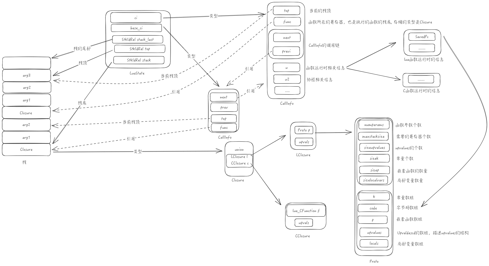
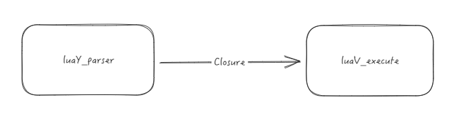

# todo

1. 整理一下这个文章
2. 需要在f_parser之前说明 top的结构


# Lua 源码阅读笔记-Lua代码执行过程

因为脚本语言通常都是解释型语言，在执行脚本语言的时候，都需要先将代码翻译成对应虚拟机的字节码，然后虚拟机会调用一些加载的函数将字节码加载到虚拟机内执行，Lua也不例外。接下来就准备窥探一下Lua在从lua代码到虚拟机开始执行字节码的整个流程，并整理流程中遇到的比较重要的数据结构和函数，为之后深入研究Lua虚拟机做一个铺垫。

这边探究的是5.4 的lua代码。

## 整体数据结构

先来看一下整体的数据结构



大概可以分为以下几个数据结构
1. LuaStatus 是Lua的虚拟机，控制着当前代码的整个环境，持有对整个栈的引用
2. CallInfo 控制单个函数调用的环境，同时通过双向链表可以获取到整个调用栈的顺序。
3. Closure 函数闭包，分为CClosure和LClosure，其中Lua的LClosure 由Proto 和 upvales构成，upvalues是对于整个栈的其他位置的变量的引用.
4. Proto 包含函数的字节码 和 局部变量、upvalues变量等DEBUG信息，可以认为这个就是函数编译后的静态的相关信息


## 整体流程 

执行lua代码的流程大致如下




在lua中整个流程大致可以分成两个子步骤

1. lua代码的词法语法分析，这边的主要函数是在 luaY_parser
2. 执行OpCode，这边主要函数是 luaV_execute


整个流程主要就是通过 luaY_parser 来产生Closure，并在 luaV_execute 中进行执行.

### f_parser 
```
static void f_parser (lua_State *L, void *ud) {
  LClosure *cl;
  struct SParser *p = cast(struct SParser *, ud);
  int c = zgetc(p->z);  /* read first character */
  if (c == LUA_SIGNATURE[0]) {
    // 加载二进制的处理
    checkmode(L, p->mode, "binary");
    cl = luaU_undump(L, p->z, p->name);
  }
  else {
    // 加载文本文件的处理
    checkmode(L, p->mode, "text");
    cl = luaY_parser(L, p->z, &p->buff, &p->dyd, p->name, c);
  }
  lua_assert(cl->nupvalues == cl->p->sizeupvalues);
  luaF_initupvals(L, cl);
}
```

这边具体不深入到 luaY_parser 的细节，这边只看 f_parser的 大致情况，可以比较明显的看出在 f_parser 中通过调用luaY_parser进行词法解析，并可以得到一个LClosure的数据结构。无论进入的是哪个分支，都可以在对应的函数中看到下面这一行调用

```
  setclLvalue2s(L, L->top.p, cl);
```
说明cl已经被放置到 L->top的位置。这个top就是当前栈的栈顶。所以在执行完整个f_parser后，栈顶就是一个Closure。这边稍微说明一下，因为这边做的是文件解析，所以到最后

## luaV_execute
```
l_sinline void ccall (lua_State *L, StkId func, int nResults, l_uint32 inc) {
  CallInfo *ci;
  L->nCcalls += inc; // 增加调用次数 

  // 栈溢出判断
  if (l_unlikely(getCcalls(L) >= LUAI_MAXCCALLS)) {
    checkstackp(L, 0, func);  /* free any use of EXTRA_STACK */
    luaE_checkcstack(L);
  }

  // 调用函数前的准备
  if ((ci = luaD_precall(L, func, nResults)) != NULL) {  /* Lua function? */
    ci->callstatus = CIST_FRESH;  /* mark that it is a "fresh" execute */

    // 执行luaV_execute，传入的是CallInfo
    luaV_execute(L, ci);  /* call it */
  }
  L->nCcalls -= inc;
}
```

调用luaV_execute的入口是ccall，这边的func是刚刚在栈内的Closure，nResult是对应闭包的返回值。

在调用luaV_execute的时候传入的不是Closure，是CallInfo。而在 luaD_precall 这个准备函数里面可以看到CallInfo 和 Closure之间是如何联系上的

```
CallInfo *luaD_precall (lua_State *L, StkId func, int nresults) {
 retry:
  switch (ttypetag(s2v(func))) {
    case LUA_VCCL:  /* C closure */
      ...
    case LUA_VLCF:  /* light C function */
      ...
    case LUA_VLCL: {  /* Lua function */
      CallInfo *ci;
      Proto *p = clLvalue(s2v(func))->p;

      int fsize = p->maxstacksize;  /* frame size */
      L->ci = ci = prepCallInfo(L, func, nresults, 0, func + 1 + fsize);  -- 建立关系
      ci->u.l.savedpc = p->code;  // 字节码指针在这里被设置到初始位置
      
      // 修复传入的参数，如果传入的参数比预计的少，就补充 NIL
      int narg = cast_int(L->top.p - func) - 1;  /* 获取真实传入的参数 */ 
      int nfixparams = p->numparams;   
      for (; narg < nfixparams; narg++)
        setnilvalue(s2v(L->top.p++));  /* complete missing arguments */

      lua_assert(ci->top.p <= L->stack_last.p);
      return ci;  
    }
    default: 
      ... // try to get '__call' metamethod
    }
  }
}

l_sinline CallInfo *prepCallInfo (lua_State *L, StkId func, int nret,
                                                int mask, StkId top) {
  CallInfo *ci = L->ci = next_ci(L);  /* new frame */
  ci->func.p = func;
  ci->nresults = nret;
  ci->callstatus = mask;
  ci->top.p = top;
  return ci;
}
```

这边只看 LUA_VLCL，这个是 lua 的函数类型，这边可以看到关系是在 prepCallInfo 中建立的，新初始的CallInfo将指针指向了Closure，并且初始化了新的调用栈的信息。

接下来看 luaV_execute 是如何执行的
```
void luaV_execute (lua_State *L, CallInfo *ci) {
  LClosure *cl;
  TValue *k;
  StkId base;
  const Instruction *pc;
  ......
  cl = clLvalue(s2v(ci->func.p));
  k = cl->p->k;
  pc = ci->u.l.savedpc;
  ......
  base = ci->func.p + 1;
  /* main loop of interpreter */
  for (;;) {
      Instruction i;
      vmfetch();  // 这边的大致相当于执行 (base = ci->func.p + 1); } i = *(pc++);
      ......
      vmdispatch (GET_OPCODE(i)) {
        vmcase(OP_MOVE){.....}
        vmcase(OP_LOADI){.....}
        vmcase(OP_LOADF){.....}
        vmcase(OP_LOADK){.....}
      }
  }
```
在for循环里，指令的执行是根据i对应的字节码进行跳转执行的，而i在循环前都会通过 i = *(pc++) 进行获取。在 for 循环前，可以看到 pc 被赋值成 ci->u.l.savedpc , 而这个位置就是 Closure中的Proto的字节码数组。


## closure中的 upvalues 这个数组是怎么生成的

对于最外层的Closure，再编译字节码的时候，就会计算出需要的upvalues数量，在 f_parser 的最后一行代码，调用了 luaF_initupvals 初始化最外层的closure。

```
void luaF_initupvals (lua_State *L, LClosure *cl) {
  int i;
  for (i = 0; i < cl->nupvalues; i++) {
    GCObject *o = luaC_newobj(L, LUA_VUPVAL, sizeof(UpVal));
    UpVal *uv = gco2upv(o);
    uv->v.p = &uv->u.value;  /* make it closed */
    setnilvalue(uv->v.p);
    cl->upvals[i] = uv;
    luaC_objbarrier(L, cl, uv);
  }
}
```
这边会把最外层的Closure都初始化成nil，这样空间就预留出来了，后续字节码就能直接对这些空间进行初始化等一系列操作。

而对于内层函数产生的Closure，我们可以通过对应的字节码发现端倪
```
function f()
    
    local a = 1
    function f2()
        a = a + 1
        return a
    end
    return f2
end
```

通过 luac -l 获取上述lua代码的字节码
```
main <test/test_main.lua:0,0> (4 instructions at 0x562d63b0ace0)
0+ params, 2 slots, 1 upvalue, 0 locals, 1 constant, 1 function
        1       [1]     VARARGPREP      0
        2       [12]    CLOSURE         0 0     ; 0x562d63b0af40
        3       [4]     SETTABUP        0 0 0   ; _ENV "f"
        4       [12]    RETURN          0 1 1   ; 0 out

function <test/test_main.lua:4,12> (6 instructions at 0x562d63b0af40)
0 params, 2 slots, 1 upvalue, 1 local, 1 constant, 1 function  
        1       [6]     LOADI           0 1                         -- 这边对应 local a = 1
        2       [10]    CLOSURE         1 0     ; 0x562d63b0b320    -- 创建闭包 函数地址是0x562d63b0b320
        3       [7]     SETTABUP        0 0 1   ; _ENV "f2"         -- 设置到 _ENV 中
        4       [11]    GETTABUP        1 0 0   ; _ENV "f2"
        5       [11]    RETURN          1 2 0k  ; 1 out
        6       [12]    RETURN          1 1 0k  ; 0 out

function <test/test_main.lua:7,10> (7 instructions at 0x562d63b0b320)  
0 params, 2 slots, 1 upvalue, 0 locals, 0 constants, 0 functions
        1       [8]     GETUPVAL        0 0     ; a
        2       [8]     ADDI            0 0 1
        3       [8]     MMBINI          0 1 6 0 ; __add
        4       [8]     SETUPVAL        0 0     ; a
        5       [9]     GETUPVAL        0 0     ; a
        6       [9]     RETURN1         0
        7       [10]    RETURN0  
```
在funcction f 中，通过 CLOSURE 创建出了对应的closure，CLOSURE 对应的字节码是OP_CLOSURE.

```
vmcase(OP_CLOSURE) {
  StkId ra = RA(i);
  Proto *p = cl->p->p[GETARG_Bx(i)];   --- 这边取出的是Proto，说明0x562d63b0b320应该对应的就是Proto
  halfProtect(pushclosure(L, p, cl->upvals, base, ra));  --- 创建Closure，并塞到栈里
  checkGC(L, ra + 1);
  vmbreak;
}

static void pushclosure (lua_State *L, Proto *p, UpVal **encup, StkId base,
                         StkId ra) {
  int nup = p->sizeupvalues;
  Upvaldesc *uv = p->upvalues;
  int i;
  LClosure *ncl = luaF_newLclosure(L, nup);
  ncl->p = p;
  setclLvalue2s(L, ra, ncl);  /* anchor new closure in stack */

  // 这边对UpValues做赋值
  for (i = 0; i < nup; i++) {  /* fill in its upvalues */
    if (uv[i].instack)  /* upvalue refers to local variable? */  
      ncl->upvals[i] = luaF_findupval(L, base + uv[i].idx);  // 如果在栈上，就通过idx直接获取赋值
    else  /* get upvalue from enclosing function */
      ncl->upvals[i] = encup[uv[i].idx];  // 如果不在栈上，说明需要通过对当前的Closure的upvalues进行间接获取
    luaC_objbarrier(L, ncl, ncl->upvals[i]);
  }
}
```
可以看到在pushClosure的时候，会新初始化一个Closure，并通过 Proto 对upvals进行初始化，如果对应的upvals是在栈上的，则引用栈上对应的idx的变量。如果不在栈上的，则引用当前的Closure的upvals的对应变量。

这边存在一个比较特殊的点，从栈上赋值的时候，通过的是 newupval
```
static UpVal *newupval (lua_State *L, StkId level, UpVal **prev) {
  GCObject *o = luaC_newobj(L, LUA_VUPVAL, sizeof(UpVal));
  UpVal *uv = gco2upv(o);
  UpVal *next = *prev;
  uv->v.p = s2v(level);  /* current value lives in the stack */  // 从这边赋值的话，是会新建一个upvalues的，
  ......
  return uv;
}
```
s2v 的方式会把栈上的值通过拷贝的方式新建一个出来，所以这个时候会导致数值、字符串等都被静态拷贝一份，相当于创建闭包的时候会固定了
```
a = {}
function f()
    for i = 1, 5 do
        a[i] = function() return i end  
    end 
end 

f()
for k, v in pairs(a) do 
    print(k, v()) 
end
-- 输出
1       1
2       2
3       3
4       4
5       5
```
而对于非栈的赋值，是直接拷贝 encup[uv[i].idx] 的， 这个时候无论是不是数值，都是变成引用。如果存在多层的upvalus的嵌套时，最好别混用这些行为。更建议都统一认为upvalues都是对外面的引用，这样出错的概率会小一点

## 使用GDB 验证

在GDB环境下执行 lua xxxx.lua 脚本，可以看到以下栈
```
#0  luaV_execute (L=0x5555557ac268, ci=0x5555557adab0) at lvm.c:1156
#1  0x00005555555642d6 in ccall (L=0x5555557ac268, func=0x5555557ac910, nResults=-1, inc=65537) at ldo.c:637
#2  0x000055555556434b in luaD_callnoyield (L=0x5555557ac268, func=0x5555557ac910, nResults=-1) at ldo.c:655
....
#7  0x000055555555b6e7 in docall (L=0x5555557ac268, narg=0, nres=-1) at lua.c:160
#8  0x000055555555bb07 in handle_script (L=0x5555557ac268, argv=0x7fffffffddd0) at lua.c:256
#9  0x000055555555c7c8 in pmain (L=0x5555557ac268) at lua.c:645
....
#18 0x000055555555c916 in main (argc=2, argv=0x7fffffffddc8) at lua.c:673
```
其中，
- 在 handle_script 中执行了 luaL_loadfile 将脚本加载到内存并完成词法分析，并将 Closure 设置到了栈顶
- 在 handle_script 中准备开始调用的时候，是通过 docall 进行的，这边n是执行lua脚本时给的参数数量，返回值个数被写死成 LUA_MULTRET
- 在 docall 中，执行前第一步就是将base 取出，base取出的方式是通过
  ```
  base = lua_gettop(L) - narg
  ```
  这样base就是词法分析得到的 Closure
- 到 ccall 后，对应的入参就是func 就是之前说的Closure，然后通过 luaD_precall 进行初始化，最后执行 luaV_execute 完成调用

## 小结

这边基本完成了对Lua内执行一个脚本的流程的分析，梳理了对应的数据结构和数据的流向，对未来更深入了解Lua虚拟机做了一些铺垫。
个人认为相比于Python的虚拟机来说，Lua虚拟机设计的还是比较精炼的，但精炼就会带来一些地方会比较难以理解，需要多看两遍用GDB跟着实验一下会更能理解其中的设计
