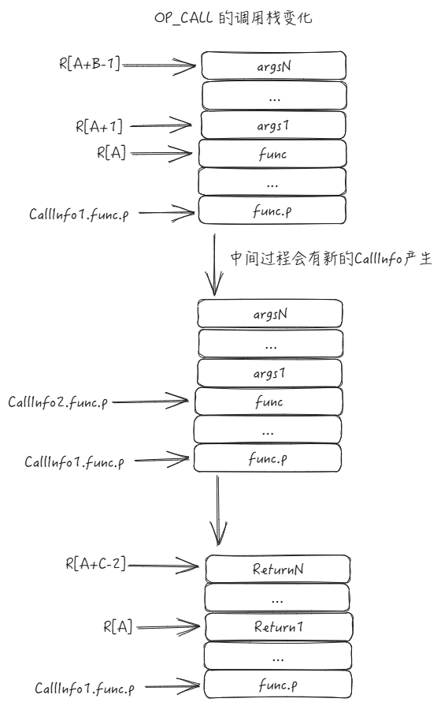
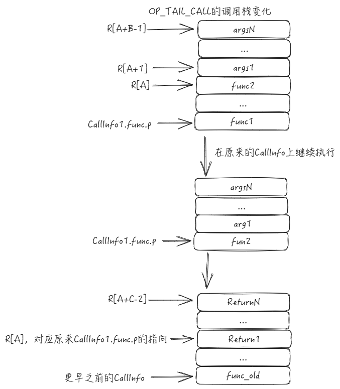

# Lua 源码阅读笔记-函数调用过程 

先来看一段Lua代码和对应的字节码

```
function f1(a, b , c)
    return c + a , b + a
end 

function <test/test_call.lua:3,5> (6 instructions at 0x55d992393f40)
3 params, 5 slots, 0 upvalues, 3 locals, 0 constants, 0 functions
        1       [4]     ADD             3 2 0
        2       [4]     MMBIN           2 0 6   ; __add
        3       [4]     ADD             4 1 0
        4       [4]     MMBIN           1 0 6   ; __add
        5       [4]     RETURN          3 3 0   ; 2 out
        6       [5]     RETURN0  


function call(a, b, c)
    local x, y = f1(a, b, c)
    return x, y
end


function <test/test_call.lua:7,10> (9 instructions at 0x55d9923942e0)
3 params, 7 slots, 1 upvalue, 5 locals, 1 constant, 0 functions
        1       [8]     GETTABUP        3 0 0   ; _ENV "f1"  将f1 函数拷贝到 3寄存器
        2       [8]     MOVE            4 0    // 移动A到4 寄存器
        3       [8]     MOVE            5 1    // 移动B到5 寄存器
        4       [8]     MOVE            6 2    // 移动C到6 寄存器
        5       [8]     CALL            3 4 3   ; 3 in 2 out   /*	A B C	R[A], ... ,R[A+C-2] := R[A](R[A+1], ... ,R[A+B-1]) */
        6       [9]     MOVE            5 3    // 将3 寄存器的东西拷贝到5 寄存器
        7       [9]     MOVE            6 4    // 将4 寄存器的东西拷贝到6 寄存器
        8       [9]     RETURN          5 3 0   ; 2 out  /*	A B C k	return R[A], ... ,R[A+B-2]	(see note)	*/
        9       [10]    RETURN0  


function tailCall(a, b, c)
    return f1(a, b, c)
end 

function <test/test_call.lua:12,14> (7 instructions at 0x55d992394880)
3 params, 7 slots, 1 upvalue, 3 locals, 1 constant, 0 functions
        1       [13]    GETTABUP        3 0 0   ; _ENV "f1"
        2       [13]    MOVE            4 0   // 移动A到4 寄存器
        3       [13]    MOVE            5 1   // 移动B到5 寄存器
        4       [13]    MOVE            6 2   // 移动C到6 寄存器
        5       [13]    TAILCALL        3 4 0   ; 3 in  /*  A B C k return R[A](R[A+1], ... ,R[A+B-1])              */
        6       [13]    RETURN          3 0 0   ; all out
        7       [14]    RETURN0  

```
在Lua中，函数调用对应的字节码分为 OP_CALL 和 OP_TAIL_CALL, 接下来就分析一下这两个操作码对应的实现

## OP_CALL

OP_CALL 字节码的参数有三个，调用的格式如下
```
/*	A B C	R[A], ... ,R[A+C-2] := R[A](R[A+1], ... ,R[A+B-1]) */
```


可以看到 OPCALL 的 操作数有三个，调用函数的时候，函数通过第一个操作数A来获取，从[A + 1, B - 1]都认为是函数的参数，如果有参数，则会将当前的栈顶修正
函数的返回个数会写入[A， A + C - 2]所在的位置。

接下来看看源码里的具体实现
```
vmcase(OP_CALL) {
    
    StkId ra = RA(i);  // R[A] 就是对应func，调用结束后的返回值第一个也存储在这个位置
    CallInfo *newci;
    int b = GETARG_B(i);  // 参数个数 
    int nresults = GETARG_C(i) - 1;  // 返回值个数

    if (b != 0)  /* fixed number of arguments? */
        L->top.p = ra + b;  /* top signals number of arguments */
    /* else previous instruction set top */
    savepc(L);  /* 用于处理异常 */
    if ((newci = luaD_precall(L, ra, nresults)) == NULL)
        updatetrap(ci);  /* 用于处理 Call C 函数的行为*/
    else {  /* Lua call: run function in this same C frame */
        // 对于LUA 函数而言，luaD_precall后就将ci换成新的ci，然后重新开始执行开始执行字节码
        ci = newci;
        goto startfunc;
    }
    vmbreak;
}

```

调用函数前会先通过luaD_precall 来做调用前的准备，如果是C的函数，则会在luaD_precall中直接调用；而如果是Lua函数则会创建一个新的CallInfo， 然后跳转到函数开头重新开始执行字节码，直到执行到RETURN 字节码

### luaD_precall

luaD_precall 的主要目的是为了产生一个CallInfo（对于Lua函数来说），所以可以想象这边就是通过R[A]的内容来对CallInfo进行填充
```
CallInfo *luaD_precall (lua_State *L, StkId func, int nresults) {
 retry:
  switch (ttypetag(s2v(func))) {
    case LUA_VCCL:  /* C closure */
      ...
    case LUA_VLCF:  /* light C function */
      ....
  case LUA_VLCL: {  /* Lua function */    
      Proto *p = clLvalue(s2v(func))->p;
      int fsize = p->maxstacksize;  /* frame size */
      int nfixparams = p->numparams;
      int i;

      ci->func.p -= delta;  /* restore 'func' (if vararg) */

      // 这边会将函数、函数参数 都写入到正确的位置
      // i = 0 的时候写入的就是函数
      for (i = 0; i < narg1; i++)  /* move down function and arguments */
          setobjs2s(L, ci->func.p + i, func + i);
      func = ci->func.p;  /* moved-down function */
      // 如果传入的函数参数小于函数的定义，这边会补齐成nil
      for (; narg1 <= nfixparams; narg1++)
          setnilvalue(s2v(func + narg1));  /* complete missing arguments */

      // 修正栈顶、修正字节码、调用类型等
      ci->top.p = func + 1 + fsize;  /* top for new function */
      ci->u.l.savedpc = p->code;  /* starting point */
      ci->callstatus |= CIST_TAIL;
      L->top.p = func + narg1;  /* set top */
      return -1;
  }
    default: {  /* not a function */
      func = luaD_tryfuncTM(L, func);  /* try to get '__call' metamethod */
      /* return luaD_precall(L, func, nresults); */
      goto retry;  /* try again with metamethod */
    }
  }
}

```
在lua函数的准备过程中，R[A]是Proto类型的数据结构。这边主要是通过Proto获取函数的字节码，函数的参数个数、返回值等行为，然后调整好CallInfo中的栈的大小、参数等信息，最后将函返回。
而对于 LUA_VCCL 和 LUA_VLCF ，他们都是C 的函数类型，都会执行 precallC ，在这个里面会完成C函数的调用。 在执行真正的f时，传入的是当前的lua_State，所以在写C扩展的时候，需要通过L的栈来获取Lua层传入的参数。执行完毕之后会调用 luaD_poscall 来清理。

### OP_RETURN 

之前说了，对于Lua函数在创建完CallInfo之后，是跳转到开头重新执行当前CallInfo的字节码，所以需要执行到RETURN 之后，才会对之前的内存进行写入。OP_RETURN的操作码如下
```
OP_RETURN,/*	A B C k	return R[A], ... ,R[A+B-2]	(see note)	*/

(*) In instructions OP_RETURN/OP_TAILCALL, 'k' specifies that the
function builds upvalues, which may need to be closed. C > 0 means
the function is vararg, so that its 'func' must be corrected before
returning; in this case, (C - 1) is its number of fixed parameters.

```
A对应的就是之前的位置，而B在这边对应的是之前的C； 而这边的C如果大于0则代表函数需要在return前被修正，k代表有多少个upvalues需要被close.

看看源码的具体实现
```
      vmcase(OP_RETURN) {
        StkId ra = RA(i); // 获取之前的写入位置
        int n = GETARG_B(i) - 1;  // 获取需要返回的参数个数
        int nparams1 = GETARG_C(i);

        if (n < 0)  /* not fixed? */  
          n = cast_int(L->top.p - ra);  /* get what is available */
        savepc(ci);

        // 处理 close upvalues 相关
        if (TESTARG_k(i)) {  /* may there be open upvalues? */
          ci->u2.nres = n;  /* save number of returns */
          if (L->top.p < ci->top.p)
            L->top.p = ci->top.p;
          luaF_close(L, base, CLOSEKTOP, 1);
          updatetrap(ci);
          updatestack(ci);
        }

        // 修正正确的函数位置
        if (nparams1)  /* vararg function? */
          ci->func.p -= ci->u.l.nextraargs + nparams1;
        // 处理函数返回
        L->top.p = ra + n;  /* set call for 'luaD_poscall' */
        luaD_poscall(L, ci, n); 
        updatetrap(ci);  /* 'luaD_poscall' can change hooks */
        goto ret;
      }

/*
** Finishes a function call: calls hook if necessary, moves current
** number of results to proper place, and returns to previous call
** info. If function has to close variables, hook must be called after
** that.
*/
void luaD_poscall (lua_State *L, CallInfo *ci, int nres) {
  int wanted = ci->nresults;  // 获取函数预期的返回值
  if (l_unlikely(L->hookmask && !hastocloseCfunc(wanted)))
    rethook(L, ci, nres);
  /* move results to proper place */
  moveresults(L, ci->func.p, nres, wanted);  // 这边会将返回值移动到正确的位置
 
  L->ci = ci->previous;  /* back to caller (after closing variables) */
}
```
对于ABCk的处理，和之前说的一样，具体不在展开。具体的赋值在 moveresults 函数中。
这个函数比较长，但逻辑上来说主要是将函数的返回值移动到 ci->func.p 的位置。并处理预期返回值和实际返回值不一致的情况。


## OP_TAILCALL

OP_TAILCALL的字节码操作如下
```
OP_TAILCALL,/*  A B C k return R[A](R[A+1], ... ,R[A+B-1])              */

(*) In instructions OP_RETURN/OP_TAILCALL, 'k' specifies that the
function builds upvalues, which may need to be closed. C > 0 means
the function is vararg, so that its 'func' must be corrected before
returning; in this case, (C - 1) is its number of fixed parameters.

```
可以看到这边的操作和 OP_RETURN一致，但在行为上和OP_CALL有着比较大的区别



其中最主要的区别就是调用的时候，是不会新生成CallInfo的，而是在原来的CallInfo上进行数据的替换。

接下来看看具体的代码是如何实现的
```
vmcase(OP_TAILCALL) {
      
      
      StkId ra = RA(i);
      int b = GETARG_B(i);  /* 获取对应的参数 */
      int n;  /* number of results when calling a C function */
      int nparams1 = GETARG_C(i);

      /* delta is virtual 'func' - real 'func' (vararg functions) */
      int delta = (nparams1) ? ci->u.l.nextraargs + nparams1 : 0;

      // 确认L->top的栈顶位置
      if (b != 0)
        L->top.p = ra + b;
      else  /* previous instruction set top */
        b = cast_int(L->top.p - ra);

      savepc(ci);  /* several calls here can raise errors */
      if (TESTARG_k(i)) {
        luaF_closeupval(L, base);  /* close upvalues from current call */
        ......
      }

      if ((n = luaD_pretailcall(L, ci, ra, b, delta)) < 0)  /* Lua function? */
        // lua func的调用是重新执行startfunc
        goto startfunc;  /* execute the callee */
      else {  /* C function? */
        // C函数调用结束的处理
        ci->func.p -= delta;  /* restore 'func' (if vararg) */
        luaD_poscall(L, ci, n);  /* finish caller */
        updatetrap(ci);  /* 'luaD_poscall' can change hooks */
        goto ret;  /* caller returns after the tail call */
      }
    } 
```
和 OpCall 一样，具体CallInfo都是在luaD_pretailcall中进行处理的

```
int luaD_pretailcall (lua_State *L, CallInfo *ci, StkId func, int narg1, int delta) {
 retry:
  switch (ttypetag(s2v(func))) {
    case LUA_VCCL:  /* C closure */
      return precallC(L, func, LUA_MULTRET, clCvalue(s2v(func))->f);
    case LUA_VLCF:  /* light C function */
      return precallC(L, func, LUA_MULTRET, fvalue(s2v(func)));
    case LUA_VLCL: {  /* Lua function */
      // 对于Lua函数的处理
      Proto *p = clLvalue(s2v(func))->p;
      int fsize = p->maxstacksize;  /* frame size */
      int nfixparams = p->numparams;
      int i;
      checkstackGCp(L, fsize - delta, func);

      ci->func.p -= delta;  /* restore 'func' (if vararg) */ // 外边的如果有C的话，那么计算出来的delta就会在这边使得函数栈底往下继续偏移

      // 在当前栈上进行赋值
      for (i = 0; i < narg1; i++)  /* move down function and arguments */
        setobjs2s(L, ci->func.p + i, func + i);
      func = ci->func.p;  /* moved-down function */
      for (; narg1 <= nfixparams; narg1++)
        setnilvalue(s2v(func + narg1));  /* complete missing arguments */

      // 设置CallInfo的其他信息
      ci->top.p = func + 1 + fsize;  /* top for new function */
      ci->u.l.savedpc = p->code;  /* starting point */
      ci->callstatus |= CIST_TAIL;
      L->top.p = func + narg1;  /* set top */
      return -1;
    }
    default: {  /* not a function */
      // 如果是table设置了元表的，就会重新尝试处理
      func = luaD_tryfuncTM(L, func);  /* try to get '__call' metamethod */
      /* return luaD_pretailcall(L, ci, func, narg1 + 1, delta); */
      narg1++;
      goto retry;  /* try again */
    }
  }
}

```
在luaD_pretailcall中，可以看到对于C函数的处理也是直接通过precallC进行调用了。而对于Lua函数来说，会将函数和参数重新赋值到当前栈上。这边可以注意
```
  for (i = 0; i < narg1; i++)  /* move down function and arguments */
    setobjs2s(L, ci->func.p + i, func + i);
```
这一句是从0开始的，0的时候赋值的就是执行的函数，后面则是执行的参数。其他行为就是重新对当前的CallInfo进行改写。

所以从整个流程上可以看出来，OpTailCall是字节在当前栈上进行构造的，所以无限递归不会造成栈溢出而是造成死循环。而且因为是复用调用栈的，所以在报错的时候会丢失中间部分栈的信息，对于某些时候的调试来说是比较不友好的，但效率的提升还是很大的。

## 小结
这边总体过了一遍 对于LUA 来说是如何执行 OP_CALL 和 OP_TAILCALL 两种字节码的，也对比了一下在模型和代码上他们的主要区别，总要来说就是是否要生成新的CallInfo的区别。
我尝试修改LUA源码，在生成字节码的时候把生成OP_TAILCALL的地方注释掉，让其生成出来的是OP_CALL的字节码，也能正常运行，可以认为OP_TAILCALL就是在满足条件的情况下对应OP_CALL的优化。在正常情况下来说，这个优化是没问题的，不过如果无限递归了，反而不会抛出异常，这一点倒是有点小麻烦。


