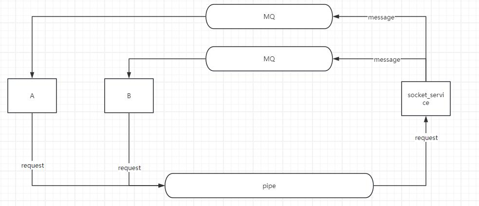

# Skynet源码阅读笔记(八)-skynet的线程类型
skynet中的线程类型可以分为一下几种类型
- 主线程
- worker 线程
- timer 线程 
- monitor 线程
- socket 线程

这些线程的初始化都在start函数里，由主线程驱动

## socket线程

从start函数中进入，可以看到初始化socket线程执行的是thread_socket函数
```
static void *
thread_socket(void *p) {
	struct monitor * m = p;
	skynet_initthread(THREAD_SOCKET);
	for (;;) {
		int r = skynet_socket_poll();
		if (r==0)
			break;
		if (r<0) {
			CHECK_ABORT
			continue;
		}
		wakeup(m,0);
	}
	return NULL;
}

int 
skynet_socket_poll() {
	struct socket_server *ss = SOCKET_SERVER;
	assert(ss);
	struct socket_message result;
	int more = 1;
	int type = socket_server_poll(ss, &result, &more);
	switch (type) {
	case SOCKET_EXIT:
		return 0;
		..........
	default:
		skynet_error(NULL, "Unknown socket message type %d.",type);
		return -1;
	}
	if (more) {
		return -1;
	}
	return 1;
}

```
这边可以看出现线程一直执行的是skynet_socket_poll，而对于返回值r，正常关机执行时返回0；出现异常返回小于0；其他情况则尝试唤醒睡眠的work进程，这边唤醒睡眠线程的条件是当所有work线程都在睡眠的时候。

skynet_socket_poll 中则是对 socket_server_poll 的包装调用，根绝socket_server_poll返回的type执行对应操作。


## socket_server
在具体看 socket_server_poll 之前，先看看 socket_server 这个数据结构。

```
struct socket_server {
	volatile uint64_t time; 	 				// 创建socket_server的时间
	int reserve_fd;				 				// 为了处理accept返回emfile错误码造成的问题
	int recvctrl_fd; 			 				// 管道的读端
	int sendctrl_fd; 							// 管道的写端
	int checkctrl;  							// 是否需要检查管道命令
	poll_fd event_fd;                           // epoll的fd
	ATOM_INT alloc_id;							// 下一个socket的ID，多个线程都有可能同时调用，所以是一个原子类型
	int event_n;							    // epoll_wait返回的事件数量
	int event_index;  							// 当前处理的epoll事件index
	struct socket_object_interface soi;		 	// 能够让数据自定义使用buffer的构造和释放
	struct event ev[MAX_EVENT];					// 对epoll_event 的一个封装
	struct socket slot[MAX_SOCKET];				// skynet包装的socket对象，因为是个数组，所以分配内存的时候直接分配好了
	char buffer[MAX_INFO];						// 在TCP环境下通用的临时缓冲区
	uint8_t udpbuffer[MAX_UDP_PACKAGE];			// 在UDP环境下通用的临时缓冲区
	fd_set rfds;								// 用于select，主要就是判断recvctrl_fd是否有事件
};

```
socket_server 结构就是整个socket 服务的核心了。 从结构上看它包装了对epoll使用和对socket的读写。接下来看看初始化它的时候做了些什么操作

### socket_server的初始化
```
void 
skynet_socket_init() {
	SOCKET_SERVER = socket_server_create(skynet_now());
}

struct socket_server * 
socket_server_create(uint64_t time) {
	int i;
	int fd[2];
	poll_fd efd = sp_create();  // 这个函数包装了对epoll_create的调用
	.... // efd的异常处理

	if (pipe(fd)) {
		... // 失败的异常处理
	}

	if (sp_add(efd, fd[0], NULL))  // 这边把读端放入到了epoll中, sp_add看起来只有LT模式
		... // 失败的异常处理
	}

	struct socket_server *ss = MALLOC(sizeof(*ss));
	ss->time = time;  // 设置了socket的启动时间
	ss->event_fd = efd;
	ss->recvctrl_fd = fd[0];
	ss->sendctrl_fd = fd[1];
	ss->checkctrl = 1;			

	// 主要是为了处理accpet的时候，fd不够导致无法关闭连接的情况
	// https://stackoverflow.com/questions/47179793/how-to-gracefully-handle-accept-giving-emfile-and-close-the-connection
	ss->reserve_fd = dup(1);	// reserve an extra fd for EMFILE  

	for (i=0;i<MAX_SOCKET;i++) {
		// 初始化socket数组内的所有socket
		struct socket *s = &ss->slot[i];
		ATOM_INIT(&s->type, SOCKET_TYPE_INVALID);
		...
	}

	// 初始化剩下的变量
	ATOM_INIT(&ss->alloc_id , 0);
	ss->event_n = 0;
	ss->event_index = 0;
	memset(&ss->soi, 0, sizeof(ss->soi));
	FD_ZERO(&ss->rfds);
	assert(ss->recvctrl_fd < FD_SETSIZE);

	return ss;
}
```
skynet_socket_init 是在skynet_start中被调用的，初始化操作中并没有做什么特殊的操作，基本上可以认为是内存的申请和对数据的清空操作，只有reserve_fd是被预留处理特殊情况的时候使用。

### 当在lua中调用了listen
在skynet中，提供了lua 层调用socket的方法，实现在 lua-socket.c 中，lua可以require socket后进行调用

```
-- lua
local socket = require "skynet.socket"
local id = socket.listen("0.0.0.0", 8001)

// c
static int
llisten(lua_State *L) {

	// 获取lua的对象，然后获取其中的数据
	const char * host = luaL_checkstring(L,1);
	int port = luaL_checkinteger(L,2);
	int backlog = luaL_optinteger(L,3,BACKLOG);
	struct skynet_context * ctx = lua_touserdata(L, lua_upvalueindex(1));

	// 调用真正的listen函数
	int id = skynet_socket_listen(ctx, host,port,backlog);
	if (id < 0) {
		return luaL_error(L, "Listen error");
	}

	// 把结果在还给lua
	lua_pushinteger(L,id);
	return 1;
}

``` 

以 listen 为例子，当lua脚本中调用了 socket.listen，那么相当于在C中调用了 skynet_socket_listen 

```
int 
skynet_socket_listen(struct skynet_context *ctx, const char *host, int port, int backlog) {
	uint32_t source = skynet_context_handle(ctx);  // 获取对应context的handle
	return socket_server_listen(SOCKET_SERVER, source, host, port, backlog);
}

int 
socket_server_listen(struct socket_server *ss, uintptr_t opaque, const char * addr, int port, int backlog) {
	int fd = do_listen(addr, port, backlog); // 函数包装了完整的的从socket的创建到listen结束， socket有设置 SO_REUSEADDR 
	if (fd < 0) {
		return -1;
	}
	struct request_package request;
	int id = reserve_id(ss); // 分配socket_server 的 socket对象的数组下标
	if (id < 0) {
		close(fd);
		return id;
	}
	// 包装消息
	request.u.listen.opaque = opaque;  // 这个字段被赋值成了对应服务的handle
	request.u.listen.id = id;   	   // 这个字段被赋值成了socket_server 的 socket对象的数组下标
	request.u.listen.fd = fd;		   // 这个字段被赋值成了真正的socket fd

	send_request(ss, &request, 'L', sizeof(request.u.listen));   //发送消息给socket_server
	return id;
}

static int
reserve_id(struct socket_server *ss) {
	int i;
	for (i=0;i<MAX_SOCKET;i++) {

		// 原子的加减分配id，保证落在int范围内，
		int id = ATOM_FINC(&(ss->alloc_id))+1;  
		if (id < 0) {
			id = ATOM_FAND(&(ss->alloc_id), 0x7fffffff) & 0x7fffffff;
		}
		struct socket *s = &ss->slot[HASH_ID(id)];
		int type_invalid = ATOM_LOAD(&s->type);
		if (type_invalid == SOCKET_TYPE_INVALID) { // 未使用的socket类型就是 SOCKET_TYPE_INVALID

			// 分配出去的就在这边修改成保留的类型
			if (ATOM_CAS(&s->type, type_invalid, SOCKET_TYPE_RESERVE)) {
				// 初始化使用的socket的数据
				s->id = id;
				s->protocol = PROTOCOL_UNKNOWN;
				// socket_server_udp_connect may inc s->udpconncting directly (from other thread, before new_fd), 
				// so reset it to 0 here rather than in new_fd.
				ATOM_INIT(&s->udpconnecting, 0);
				s->fd = -1;
				return id;
			} else {
				// retry
				--i;
			}
		}
	}
	return -1;
}

```

当在lua中调用了listen后，做的事实际上是调用线程自行申请fd，然后去申请 socket_server 包装的socket对象，打包好之后通过send_request发送给socket_server。
不过我有点疑惑的是，为什么在申请 socket_server 包装的socket对象的时候不用uint？这样就不用处理溢出情况了


### send_request
先看看 request_package 是如何包装消息的

```
struct request_package {
	uint8_t header[8];	// 6 bytes dummy

	union {
		char buffer[256];
		struct request_open open;
		struct request_send send;
		struct request_send_udp send_udp;
		struct request_close close;
		struct request_listen listen;
		struct request_bind bind;
		struct request_resumepause resumepause;
		struct request_setopt setopt;
		struct request_udp udp;
		struct request_setudp set_udp;
	} u;  // 每种消息类型都是一个结构体，用union 包起来

	uint8_t dummy[256];
};

struct request_listen {
	int id;
	int fd;
	uintptr_t opaque;
	char host[1];
};

```
request_package的union包含了所有请求类型的消息体，其中的buffer[256]表明消息类型最大是256个字节。
这边我疑惑的是request_package 中前6个字节和后256字节都标记成了dummy, 暂时不确定这些占位字节的意义，可能是用来留做扩展？


```
static void
send_request(struct socket_server *ss, struct request_package *request, char type, int len) {
	request->header[6] = (uint8_t)type;
	request->header[7] = (uint8_t)len;
	const char * req = (const char *)request + offsetof(struct request_package, header[6]);
	for (;;) {
		ssize_t n = write(ss->sendctrl_fd, req, len+2);
		if (n<0) {
			if (errno != EINTR) {
				skynet_error(NULL, "socket-server : send ctrl command error %s.", strerror(errno));
			}
			continue;
		}
		assert(n == len+2);
		return;
	}
}
```

以 request_listen 为例子，在socket_server_listen中是直接对局部变量的request中u进行赋值即可，在真正调用发送函数send_request的时候，传入的就是统一的结构体。把每个协议具体细节屏蔽了。不过在发送的时候，需要传入request具体的长度。这个就需要在每个协议发送前自己算出来了

在这边可以看到send_request的前6个字节是直接跳过的，然后len的类型也是被强制转成uint8了，所以一个request_message的最大程度也只能是256。

同时还需要注意到这边写入的处理实际上是必须要保证完全写入的，对于非阻塞的管道，write操作必须阻塞到所有数据都完全写入到管道中。
>	If a process attempts to read from an empty pipe, then read(2) will block until data is available.  If a process attempts to write to a full pipe (see below), then write(2) blocks until sufficient data has been read from the pipe to allow the write to complete.

在调用write的时候，如果进程收到信号的话，那么就有可能会触发EINTR 打断正在执行的系统调用。而且这边时在完全没有写入数据之前才会出现EINTR错误。
>	If a blocked call to one of the following interfaces is interrupted by a signal handler, then the call is automatically restarted after the signal handler returns if the SA_RESTART flag was used; otherwise the call fails with the error EINTR:
read(2), readv(2), write(2), writev(2), and ioctl(2) calls on "slow" devices.  A "slow" device is one where the I/O call may block for an indefinite time, for example, a terminal, pipe, or socket.  If an I/O call on a slow device has already transferred some data by the time it is interrupted by a signal handler, then the call will return a success status(normally, the number of bytes transferred).  Note that a (local) disk is not a slow device according to this definition; I/O operations on disk devices are not interrupted by signals.

### socket 处理管道消息 

worker线程把数据发送到管道以后，接下来的事情就得看socket线程的了。在最开始的时候说过 socket线程一直执行的是socket_server_poll函数，那就先看看socket_server_poll 函数大致执行的内容是怎么样的。
```
int 
socket_server_poll(struct socket_server *ss, struct socket_message * result, int * more) {
	for (;;) {
		if (ss->checkctrl) {
			... // 检查是否有管道消息，并进行处理
		}
		if (ss->event_index == ss->event_n) {
			... // epoll 的消息处理完毕了，那就重新进入epoll_wait
		}
		... // 处理 ss->event_index++ 对应的epoll消息	
	}
}
```

socket_server_poll 主要分成三个部分：
1. 检查是否有管道传入的消息
2. 如果没有更多的消息需要执行，则执行epoll_wait
3. 如果有还没有处理完毕的消息，则继续处理

在初始化的时候，管道的读端就被塞入到了epoll中。当管道可读的时候，就会通过从epoll_wait中读取出来。

把 关于管道的部分展开
```
	for (;;) {
		if (ss->checkctrl) { // 判断是否存在检查管道标记
			if (has_cmd(ss)) { //检查管道是否可读,
				int type = ctrl_cmd(ss, result); // 处理管道消息
				if (type != -1) {
					clear_closed_event(ss, result, type);
					return type;
				} else
					continue;
			} else {
				ss->checkctrl = 0; //
			}
		}

		if (ss->event_index == ss->event_n) {
			ss->event_n = sp_wait(ss->event_fd, ss->ev, MAX_EVENT); // 阻塞epoll_wait等待可操作的事件
			ss->checkctrl = 1;  //是否检查管道的标记
			if (more) {
				*more = 0;
			}
			ss->event_index = 0;  //处理epoll事件的下标重置成0
			if (ss->event_n <= 0) {
				... // 错误处理
				continue;
			}
		}

		struct event *e = &ss->ev[ss->event_index++];
		struct socket *s = e->s;
		if (s == NULL) {
			// dispatch pipe message at beginning
			continue;
		}

		... // 处理 ss->event_index++ 对应的epoll消息	
	}
```
由这部分可以知道：
1. 每次socket线程在从epoll_wait中返回之后，都会标记检查命令管道。
2. 在处理返回的事件时，如果事件的socket是空的，则说明是管道的消息可读。
3. for循环开始的时候判断 checkctrl ，这个变量只会在 初始化和epoll返回的时候被设置, 所以一次处理事件处理的时候，会优先把这次事件的所有管道消息给处理掉

而 ctrl_cmd 才是处理命令的核心, 具体看一下代码
```
static int
ctrl_cmd(struct socket_server *ss, struct socket_message *result) {
	int fd = ss->recvctrl_fd;
	// the length of message is one byte, so 256 buffer size is enough.
	uint8_t buffer[256];
	uint8_t header[2];
	block_readpipe(fd, header, sizeof(header));
	int type = header[0];
	int len = header[1];
	block_readpipe(fd, buffer, len);
	// ctrl command only exist in local fd, so don't worry about endian.
	switch (type) {
		...
	case 'L':
		return listen_socket(ss,(struct request_listen *)buffer, result);
		...
	default:
		skynet_error(NULL, "socket-server: Unknown ctrl %c.",type);
		return -1;
	};

	return -1;
}

static int
listen_socket(struct socket_server *ss, struct request_listen * request, struct socket_message *result) {
	int id = request->id;
	int listen_fd = request->fd;
	struct socket *s = new_fd(ss, id, listen_fd, PROTOCOL_TCP, request->opaque, false);
	if (s == NULL) {
		goto _failed;
	}
	ATOM_STORE(&s->type , SOCKET_TYPE_PLISTEN);
	result->opaque = request->opaque;
	result->id = id;
	result->ud = 0;
	result->data = "listen"; 

	....
	return SOCKET_OPEN;
_failed:
	... // 错误处理
	return SOCKET_ERR;
}
```

ctrl_cmd 中会从管道中读取出对应的header 和 body。之前分析过，管道的写入一定是完整的数据，不会存在一半的数据，所以管道读端也可以不用处理一半的包的情况。
这边先读取固定2字节的header，也就是type 和 len， 再根据len 去读取具体的数据到buffer中。

数据包重装完毕之后，会根据类型转成把buffer强转成对应类型的数据丢入到具体的处理函数当中。

还是以listen 为例子，这边收到的类型是 'L', 具体的处理函数是listen_socket。listen_socket中主要就是把request中的fd 和 socket_server 中的一个fd关联起来。这边可以注意到一个事情，关联完毕之后，还对result进行了一些操作。 

顺着这result去看，我们可以找到在传入 socket_server_poll 的时候，reuslt就是一个指针。所以result会被还给带调用 socket_server_poll 的位置， 也就是 skynet_socket_poll。

所以这边可以理解成socket处理完对应消息后，会对管道消息进行回包。

```
int 
skynet_socket_poll() {
	struct socket_server *ss = SOCKET_SERVER;
	assert(ss);
	struct socket_message result;
	int more = 1;
	int type = socket_server_poll(ss, &result, &more);
	switch (type) {
	......
	case SOCKET_OPEN:
		forward_message(SKYNET_SOCKET_TYPE_CONNECT, true, &result);
		break;
	......
	default:
		skynet_error(NULL, "Unknown socket message type %d.",type);
		return -1;
	}
	if (more) {
		return -1;
	}
	return 1;
}

```

回到 skynet_socket_poll ，我们可以看到这边处理了 listen_socket 返回的 SOCKET_OPEN，然后把处理过的result传入到 forward_message

```
// mainloop thread
static void
forward_message(int type, bool padding, struct socket_message * result) {
	struct skynet_socket_message *sm;
	size_t sz = sizeof(*sm);
	if (padding) {
		.... //填充字节
	}
	sm = (struct skynet_socket_message *)skynet_malloc(sz);
	sm->type = type;
	sm->id = result->id;
	sm->ud = result->ud;

	......
	struct skynet_message message;
	message.source = 0;
	message.session = 0;
	message.data = sm;
	message.sz = sz | ((size_t)PTYPE_SOCKET << MESSAGE_TYPE_SHIFT);
	
	if (skynet_context_push((uint32_t)result->opaque, &message)) {
		// 处理失败错误
	}
}
```
forward_message 内容不多，就是把reuslt的结果包装成 skynet_message，然后通过skynet_context_push传入到对应的skynet_context进行处理，还记得一开始opaque吗？它在最开始调用 socket_server_listen 的时候，就被赋值成了调用函数的服务的handle了。 同时在new_fd的时候，这个opaque也会被写入到包装的socket中，后面有socket 收到的消息时，就可以找到对应handle进行分发了。


## 总结
skynet_socket_poll是由socket线程不断调用处理的，skynet_socket_poll 上由是通过socket_server_poll处理网络数据的，处理完毕之后通过对应的type 和 result 来将结果进行分发到对应skynet_context来进行处理。





这边只简单以 listen 行为把skynet底层的网络模型进行了分析，实际上收发包的内容也是相当重要的，后面有空可以了可以再写一篇详细分析一下其中的内容


