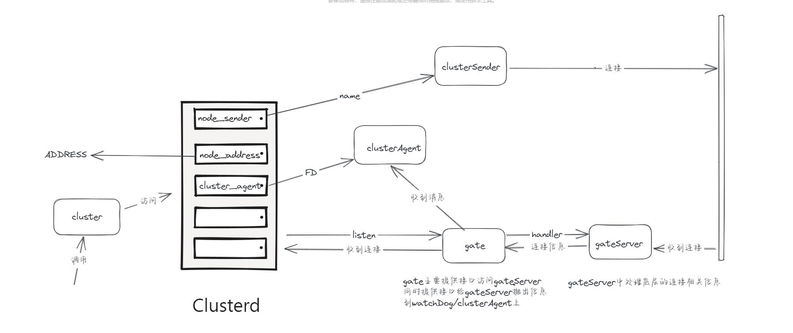

# Skynet源码阅读笔记-cluster模式分析

项目中主要用到的是cluster模式，这边就简单的分析一下具体它是如何运作的。

## cluster 模型


从途中可以看出clusterd才是cluter集群模式的主体，其中保存了两个主要的数据结构用于发送和接受消息。 从clusterSender 发起的连接会通过gateserver收到并通过clusterd创建的clusterAgent进行消息的处理。

## cluster.lua
在使用的时候，需要将cluster require进来。而 cluster 这个文件本身主要是提供对外接口，在require的时候会执行init，init中调用uniqueserver来生成一个 clusterd 的服务，这个服务才是cluster模式的主体。


## clusterd.lua
cluter集群的主体，这边会对处理对其他clusterd的连接和消息处理。

### listen

```
---  cluster.lua
function cluster.open(port, maxclient)
	if type(port) == "string" then
		return skynet.call(clusterd, "lua", "listen", port, nil, maxclient)
	else
		return skynet.call(clusterd, "lua", "listen", "0.0.0.0", port, maxclient)
	end
end

--- clusterd.lua
function command.listen(source, addr, port, maxclient)
	local gate = skynet.newservice("gate")
	if port == nil then
		...
	else
		local realaddr, realport = skynet.call(gate, "lua", "open", { address = addr, port = port, maxclient = maxclient })
		skynet.ret(skynet.pack(realaddr, realport))
	end
end
```
当外部调用open的时候，会转发到clusterd的listen接口，该接口会创建一个gate的service，然后调用gate的open接口，成功后返回实际的地址和端口。

### 发起连接

```
---  cluster.lua
function cluster.reload(config)
	skynet.call(clusterd, "lua", "reload", config)
end


--- clusterd.lua
function command.reload(source, config)
	loadconfig(config)
	skynet.ret(skynet.pack(nil))
end

```
当调用cluter的reload接口，并传入对应的配置后，相当于调用的是clusterd.loadconfig(config), 这个config的格式是 {name: addr},具体看看loadconfig中做了什么

```
--- clusterd.lua

local node_channel = setmetatable({}, { __index = open_channel })
function loadconfig(tmp)
	if tmp == nil then
		... --- 传入空的时候 读环境配置
	end
	local reload = {}
	for name,address in pairs(tmp) do
		if name:sub(1,2) == "__" then
			--- 特殊开头的名字需要输出一下
			....
		else
			assert(address == false or type(address) == "string")
			if node_address[name] ~= address then
				-- address changed
				--- 原有连接的地址变了
				if node_sender[name] then
					-- reset connection if node_sender[name] exist
					node_channel[name] = nil
					table.insert(reload, name)
				end
				node_address[name] = address
			end
			local ct = connecting[name]
			if ct and ct.namequery and not config.nowaiting then
				--- 查询地址的处理
				skynet.error(string.format("Cluster node [%s] resloved : %s", name, address))
				skynet.wakeup(ct.namequery)
			end
		end
	end
	if config.nowaiting then
		--- 有设置nowaiting的特殊处理
		....
	end
	for _, name in ipairs(reload) do
		-- open_channel would block
		skynet.fork(open_channel, node_channel, name)
	end
end

```

node_address 维护的是名字到地址的映射，node_sender 维护的是名字到sender的映射，当访问不存在的name时，会触发open_channel。

loadConfig中做的主要是将传入的{name:address}的配置进行处理，如果之前不在node_address 中的，则标记需要连接；如果之前在node_address中的，则说明已经连接上了，需要重新连接。最后对每一个需要连接的配置启动一个协程进行open_channel的操作。

### open_channel

open_channel 的主要目的就是连接对应的地址

```
--- 这边 t 是node_channel， key是对应name
local function open_channel(t, key)
	local ct = connecting[key]
	if ct then
		... --- 如果已经在连接了，则这边不会重复连接，协程会被挂起到另一个协程连接完成
	end
	ct = {}
	connecting[key] = ct
	local address = node_address[key]
	if address == nil and not config.nowaiting then
		--- 如果连接的name没有对应的地址，则会挂起该协程，直到reload 对应配置的时候被唤醒
		...
	end
	local succ, err, c
	if address then
		local host, port = string.match(address, "([^:]+):(.*)$")
		c = node_sender[key]
		if c == nil then
			--- 创建对应的sender
			c = skynet.newservice("clustersender", key, nodename, host, port)
			if node_sender[key] then
				-- double check
				skynet.kill(c)
				c = node_sender[key]
			else
				node_sender[key] = c
			end
		end

		--- 调用sender的changenode
		succ = pcall(skynet.call, c, "lua", "changenode", host, port)

		if succ then
			t[key] = c
			ct.channel = c
            node_sender_closed[key] = nil
		else
			err = string.format("changenode [%s] (%s:%s) failed", key, host, port)
		end
	elseif address == false then
		c = node_sender[key]
		if c == nil or node_sender_closed[key] then
			-- no sender or closed, always succ
			succ = true
		else
			-- trun off the sender
			--- 如果地址是false，则直接关闭对应的sender
			succ, err = pcall(skynet.call, c, "lua", "changenode", false)
                        if succ then --trun off failed, wait next index todo turn off
                                node_sender_closed[key] = true
                        end
		end
	else
		err = string.format("cluster node [%s] is absent.", key)
	end

	--- 唤醒所有等待连接的协程
	connecting[key] = nil
	for _, co in ipairs(ct) do
		skynet.wakeup(co)
	end

	--- 在检查一遍地址，如果不正确则再次连接
	if node_address[key] ~= address then
		return open_channel(t,key)
	end
	assert(succ, err)
	return c
end

```
open_channel 看起来有点长，实际并不会很复杂。主要目的就是为了创建clustersender，并调用其changenode。这边可以简单认为调用成功的话，就是连接完毕了。

## gate 和 gateServer
现在目光来到gate这边，因为上面发起连接之后，对方处理listen的gate此时应该就会收到对应的信息。

gate.lua文件里面可以看到实际上这个文件就是一个中间层，提供gateserver到外部的消息接口 以及 外部调用到gateServer的接口。

在gate 这个文件的最后，执行了
```
local handler = {}
gateserver.start(handler)
```

这个handler是gate.lua中的一个局部变量，用来承接从gateServer中抛出的事件转发给外部用的。

在clusterd创建geta的时候，还顺便调用了open这个接口

```
function handler.open(source, conf)
	watchdog = conf.watchdog or source
	return conf.address, conf.port
end
```

open接口内就把clusterd作为watchdog给保存了下来。

### gateServer

gateServer.lua中也有很多的函数，但不用害怕，绝大多是都是命令，这边初始化的时候就只执行了下面这段代码

```	
	...
	skynet.register_protocol {
		name = "socket",
		id = skynet.PTYPE_SOCKET,	-- PTYPE_SOCKET = 6
		unpack = function ( msg, sz )
			return netpack.filter( queue, msg, sz)
		end,
		dispatch = function (_, _, q, type, ...)
			queue = q
			if type then
				MSG[type](...)
			end
		end
	}

	local function init()
		skynet.dispatch("lua", function (_, address, cmd, ...)
			local f = CMD[cmd]
			if f then
				skynet.ret(skynet.pack(f(address, ...)))
			else
				skynet.ret(skynet.pack(handler.command(cmd, address, ...)))
			end
		end)
	end

	if handler.embed then
		init()
	else
		skynet.start(init)
	end
```
这边注册了 skynet.PTYPE_SOCKET 这个类型的协议，已经lua 类型的协议的dispatch方式。lua类型的协议搜索空间是CMD，而 skynet.PTYPE_SOCKET 的搜索空间是MSG

### accept
当底层收到连接了之后，会抛出连接的信息给到gateServer

```
int 
skynet_socket_poll() {
	struct socket_server *ss = SOCKET_SERVER;
	assert(ss);
	struct socket_message result;
	int more = 1;
	int type = socket_server_poll(ss, &result, &more);
	switch (type) {
	...
	case SOCKET_ACCEPT:
		forward_message(SKYNET_SOCKET_TYPE_ACCEPT, true, &result);
		break;
	}
	if (more) {
		return -1;
	}
	return 1;
}
```
forward_message 会将 SOCKET_ACCEPT 包装成 id为 skynet.PTYPE_SOCKET 的信息，其中还会把 skynet_socket_message 的type标记成 SKYNET_SOCKET_TYPE_ACCEPT。

在gateServer中接到这个消息后，会netpack.filter将其解开，得到对应的type为open，这一步是在lua-netpack.c中处理的。

```
	--- gateServer.lua
	function MSG.open(fd, msg)
		client_number = client_number + 1
		if client_number >= maxclient then
			socketdriver.shutdown(fd)
			return
		end
		if nodelay then
			socketdriver.nodelay(fd)
		end
		connection[fd] = true
		handler.connect(fd, msg)
	end

	--- gate.lua
	function handler.connect(fd, addr)
		local c = {
			fd = fd,
			ip = addr,
		}
		connection[fd] = c
		skynet.send(watchdog, "lua", "socket", "open", fd, addr)
	end
```
gateServer中open最主要的事情也就是将这个事件调出去，而gate中则是将对应的连接保存后，给watchdog发送消息，因为clueted在一开始的时候就将自己设置成了watchdog，所以这边消息就又回到了clusterd上。

```
--- clusterd.lua
function command.socket(source, subcmd, fd, msg)
	if subcmd == "open" then
		skynet.error(string.format("socket accept from %s", msg))
		-- new cluster agent
		cluster_agent[fd] = false
		local agent = skynet.newservice("clusteragent", skynet.self(), source, fd)
		local closed = cluster_agent[fd]
		cluster_agent[fd] = agent
		if closed then
			skynet.send(agent, "lua", "exit")
			cluster_agent[fd] = nil
		end
	else
		...
	end
end
```
clusterd 上对于这个消息的处理就是将对应cluster_agent给创建出来，如果之前有对应fd的连接信息，则关闭掉之前的。

### clusteragent
来到 clueteragent的创建

```
skynet.start(function()

	--- 注册协议
	skynet.register_protocol {
		name = "client",
		id = skynet.PTYPE_CLIENT,
		unpack = cluster.unpackrequest,
		dispatch = dispatch_request,
	}

	-- fd can write, but don't read fd, the data package will forward from gate though client protocol.
	--- 此时fd只能写不能读，需要通过forward协议完成后续的内容
	skynet.call(gate, "lua", "forward", fd) 

	--- 完成disptach的处理
	skynet.dispatch("lua", function(_,source, cmd, ...)
		if cmd == "exit" then
			socket.close_fd(fd)
			skynet.exit()
		elseif cmd == "namechange" then
			register_name = new_register_name()
		else
			skynet.error(string.format("Invalid command %s from %s", cmd, skynet.address(source)))
		end
	end)
end)

```

clusteragent在创建的时候有一个特殊的处理是给gate发送了一个forward 的协议，发送forward之后会导致gate的连接状态更新，把连接的agent更新成clusteragent。同时也会让底层更新对应的socket状态

```
--- gate.lua
function CMD.forward(source, fd, client, address)
	local c = assert(connection[fd])
	unforward(c)
	c.client = client or 0
	c.agent = address or source
	gateserver.openclient(fd)
end

--- gateserver.lua
function gateserver.openclient(fd)
	if connection[fd] then
		socketdriver.start(fd)
	end
end

--- lua-socket.c
void
socket_server_start(struct socket_server *ss, uintptr_t opaque, int id) {
	struct request_package request;
	request.u.resumepause.id = id; --- 这个id 就是 lua传进来的fd
	request.u.resumepause.opaque = opaque;
	send_request(ss, &request, 'R', sizeof(request.u.resumepause));  --- 这边给socket_server.c发送
}

--- socket_server.c

static int
resume_socket(struct socket_server *ss, struct request_resumepause *request, struct socket_message *result) {
	int id = request->id;
	... --- 处理一些特殊的异常情况
	uint8_t type = ATOM_LOAD(&s->type);
	if (type == SOCKET_TYPE_PACCEPT || type == SOCKET_TYPE_PLISTEN) {
		ATOM_STORE(&s->type , (type == SOCKET_TYPE_PACCEPT) ? SOCKET_TYPE_CONNECTED : SOCKET_TYPE_LISTEN);
		s->opaque = request->opaque;
		result->data = "start";
		return SOCKET_OPEN;
	} 
	... --- 处理一些特殊的异常情况
	return -1;
}

```
forward 信息最后回到底层之后，正常情况下会修改对应socket的信息，将type变成 SOCKET_TYPE_CONNECTED.


## 发送消息

当我们要发送消息的时候，使用的是 cluster.call  这个接口
```
--- cluster.lua
function cluster.call(node, address, ...)
	-- skynet.pack(...) will free by cluster.core.packrequest
	local s = sender[node]
	if not s then
		--- 还没有的时候会进行等待处理
	end
	return skynet.call(s, "lua", "req", address, skynet.pack(...))
end

--- clusterSender.lua
function command.req(...)
	local ok, msg = pcall(send_request, ...)
	if ok then
		if type(msg) == "table" then
			skynet.ret(cluster.concat(msg))
		else
			skynet.ret(msg)
		end
	else
		skynet.error(msg)
		skynet.response()(false)
	end
end

local function send_request(addr, msg, sz)
	-- msg is a local pointer, cluster.packrequest will free it
	local current_session = session
	local request, new_session, padding = cluster.packrequest(addr, session, msg, sz)
	session = new_session
	....
	return channel:request(request, current_session, padding)
end
```

这个接口是通过node来找到对应的sender，最终通过channel的request来发送数据，这边可以认为就是给对应的fd发送数据。


## 接受消息

```
--- gateserver.lua
local function dispatch_msg(fd, msg, sz)
	if connection[fd] then
		handler.message(fd, msg, sz)
	else
		skynet.error(string.format("Drop message from fd (%d) : %s", fd, netpack.tostring(msg,sz)))
	end
end

MSG.data = dispatch_msg

--- gate.lua
function handler.message(fd, msg, sz)
	-- recv a package, forward it
	local c = connection[fd]
	local agent = c.agent
	if agent then
		-- 这边就是clusteragent
		-- It's safe to redirect msg directly , gateserver framework will not free msg.
		skynet.redirect(agent, c.client, "client", fd, msg, sz)
	else
		skynet.send(watchdog, "lua", "socket", "data", fd, skynet.tostring(msg, sz))
		-- skynet.tostring will copy msg to a string, so we must free msg here.
		skynet.trash(msg,sz)
	end
end

```
在gateserver.lua中接受消息后 调用的是MSG.data 接口，这边会调用handler的message，转发给对应的clusteragent, 这边转发的消息类型会变成client

### clusteragent

在clueteragent中，对于client的消息是通过dispatch_request进行处理
```
local function dispatch_request(_,_,addr, session, msg, sz, padding, is_push)
	...
	local ok, response
	if addr == 0 then
		... ---  查询名字相关
	else
		if cluster.isname(addr) then
			addr = register_name[addr]
		end
		if addr then
			if is_push then
				skynet.rawsend(addr, "lua", msg, sz)
				return	-- no response
			else
				...
				ok , msg, sz = pcall(skynet.rawcall, addr, "lua", msg, sz)
			end
		else
			ok = false
			msg = "Invalid name"
		end
	end
	if ok then
		--- 打包回包数据
		response = cluster.packresponse(session, true, msg, sz)
		if type(response) == "table" then
			for _, v in ipairs(response) do
				socket.lwrite(fd, v)
			end
		else
			socket.write(fd, response)
		end
	else
		response = cluster.packresponse(session, false, msg)
		socket.write(fd, response)
	end
end
```
这边化简后的代码如上，总的来说就是解析对应的数据，然后发送给对应的名字的服务，这个名字需要由其他服务主动来注册。调用完毕之后就会将数据打包，然后通过对应的socket write的方式将回包数据写入fd中。


# 小结
这边基本把 cluster模式中几个比较重要的事情以源码分析的方式都分析了一下，虽然篇幅较长，但我感觉只要耐心看完应该会由收获。不过我个人没有get到为什么要读写分离成sender和agent的方式，可能是为了复用先用代码是新的一些功能？如果由我来实现的话，我可能会将这两个写在同一个结构内，感觉会更加统一一点。