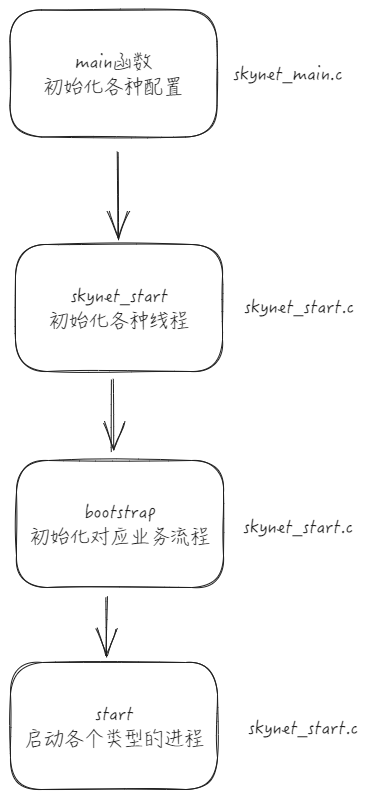

# Skynet源码阅读笔记-Skynet进程架构总览

skynet进程在架构如上图所示，skynet的主要工作模式就是通过创建很多的服务来完成的，服务与服务之间相互隔离，通过消息队列的方式将消息投递到对应的服务上。无论这个消息是来自网络、定时器或者是其他模块之间的消息，他们都会被打包成相同的类型，通过type来区别。

skynet的主线程的启动流程大致也如上，启动完毕后久等待信号关闭线程进行资源回收了。

其中业务流程是在bootstrap中进行启动的，业务根据自己的需要改写lua层面的启动流程即可。

# 个人理解

skynet的这种方式模式可以认为是单进程多线程的一个模型，对于内存共享行的业务来说比较合适，它的主要业务处理是通过worker线程来完成的，在一台机器上启动足够多的即可充分使用机器性能，对于跨线程的消息投递来说也可以节省序列化相关的CPU消耗。但如果使用不当，感觉也会出现比较奇怪的问题（假设发送之后立即把对象给改写了的话，感觉可能会出现问题）。

存在的其他缺陷的话就是容易对于一些公用功能，如果存在特别大量消息要处理的话，那可能就会存在异常；又或者是类似socket线程调用了阻塞式的系统API的话，就会导致所有业务都无法正常进行了。在实际生产过程中遇到过一次使用skynet去发送http请求，但dns服务器发生了一些异常，导致socket线程被卡住的情况。

但总归来说，skynet的提供的主要功能就是
1. 隔离各个业务模块
2. 单进程多线程尽量提升单台机器性能

对于一些跨机器的业务，skynet也提供了cluster集群等对应的解决思路，但其中有一些设计个人感觉会有点奇怪，在做完整的架构设计前，最好花一些时间去了解。