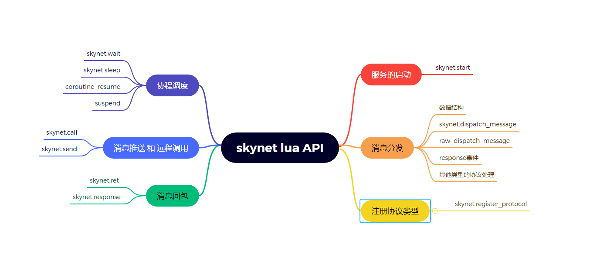

# skynet API
skynet 的API在 [LuaAPI](https://github.com/cloudwu/skynet/wiki/LuaAPI) 中由简单的使用方式介绍，这边针对其中的部分API做一些源码上的分析

# API 分类



这边将会按上面的几个大类来对 skynet 的 lua层常用API 进行源码上的分析

# 源码分析

## 服务的启动
skynet启动函数必须使用skynet.start来传入一个函数进行启动，这边分析一下skynet.start的源码，看看具体做了什么

###  skynet.start
在lua层启动一个服务的时候，是skynet.star这个API来启动的，启动时传入一个自定义的函数，在适当的时机会被调用以启动具体的服务。

```
function skynet.start(start_func)
	c.callback(skynet.dispatch_message)  -- 将当前服务的回调设置成disptach_message
	init_thread = skynet.timeout(0, function()  -- 设置一个定时器，在帧末尾执行skynet.init_service(start_func).  主要这边回调的时候执行的是dispatch
		skynet.init_service(start_func)
		init_thread = nil
	end) -- 同时，skynet.timeout这边会产生一个协程
end

function skynet.init_service(start)
	local function main()
		skynet_require.init_all()  -- 执行start前会调用init_all
		start()
	end
	local ok, err = xpcall(main, traceback)  -- 通过xpcall的方式调用main，main中执行start函数
	if not ok then
		skynet.error("init service failed: " .. tostring(err))
		skynet.send(".launcher","lua", "ERROR")
		skynet.exit()
	else
		skynet.send(".launcher","lua", "LAUNCHOK")
	end
end

```
启动前会先调用skynet_require.init_all()， 这个函数可以让用户预先require所需要的文件。
启动的时候是将当前服务的回调函数设置城 skynet.dispatch_message, 注意这边不单单是设置定时器的回调，而是设置的服务的事件回调函数，这边的事件包括定时器、网络信息等。然后设置一个0秒后的定时器进行回调，skynet.timeout这个接口会产生一个协程用于执行回调函数。

## 消息分发
这边消息指的是从skynet底层抛出的消息事件，在start的时候，将处理这个事件的函数指定成了 skynet.dispatch_message ，这边看看消息是如何在这个函数中被处理的

###  数据结构
继续往下前，先看一些协程相关数据结构，避免在看源码的时候会被这些数据结构的含义给阻塞

```
local session_id_coroutine = {}  -- session 到 co 的映射
local session_coroutine_id = {}  -- co 到 session 的映射
local session_coroutine_address = {}  -- co 到 来源服务的映射
local session_coroutine_tracetag = {}  -- co 到 traceId的映射，用来记录协程的日志行为记录
local unresponse = {} -- 使用skynet.response获得闭包且并没有使用闭包进行回包处理的协程


local wakeup_queue = {}  --被唤醒的co，co之前是主动sleep的
local sleep_session = {}   -- token 到 session的 映射 

local fork_queue = { h = 1, t = 0 }   -- 保存 主动调用skynet.fork时产生的协程


```

这边co指的是协程，session是由skynet产生，用来对应挂起的co；traceId是用来记录对应co的行为日志使用的。
sleep_session 中 保存token 到 主动sleep的协程对应的session 的映射 ，token是由用户置顶或者系统生成的。

### skynet.dispatch_message

```
function skynet.dispatch_message(...)
	local succ, err = pcall(raw_dispatch_message,...)  -- raw_dispatch_message中需要根据不同的事件类型来执行对应的处理函数
	while true do
		if fork_queue.h > fork_queue.t then -- 如果队列中没有需要处理的事件，则退出
			-- queue is empty
			fork_queue.h = 1
			fork_queue.t = 0
			break
		end
		-- pop queue
		local h = fork_queue.h      -- 取出队列中需要处理的协程
		local co = fork_queue[h]
		fork_queue[h] = nil
		fork_queue.h = h + 1

		local fork_succ, fork_err = pcall(suspend,co,coroutine_resume(co))  -- 执行协程
		if not fork_succ then
			... -- 这边只是对错误信息进行拼接
		end
	end
	assert(succ, tostring(err))   -- 如果有报错则统一输出
end
```

skynet.dispatch_message 的过程可以看成两个部分
1. 通过 raw_dispatch_message 来处理事件
2. 执行fork_queue中的协程，这部分是用户主动调用skynet.fork产生的

### raw_dispatch_message 

```
local function raw_dispatch_message(prototype, msg, sz, session, source)
	-- skynet.PTYPE_RESPONSE = 1, read skynet.h
	if prototype == 1 then
		-- 处理 response
		... 
	else
		-- 处理其他数据
		...
	end
end

```
raw_dispatch_message的参数含义如下
- prototype 事件类型，具体看 skynet.h
- msg 消息
- sz 消息长度
- session 执行事件的协程标记
- source 消息来源

整个 raw_dispatch_message 分成 response事件 和 其他事件 这两个部分来分析

### response事件
```
	if prototype == 1 then
		local co = session_id_coroutine[session]
		if co == "BREAK" then
			session_id_coroutine[session] = nil
		elseif co == nil then
			unknown_response(session, source, msg, sz)
		else
			local tag = session_coroutine_tracetag[co]
			if tag then c.trace(tag, "resume") end
			session_id_coroutine[session] = nil
			suspend(co, coroutine_resume(co, true, msg, sz, session))
		end
	else
		...
	end
```

response事件 通过session 来找到对应的执行协程，如果协程是不存在或者是处于"BREAK"的状态的话，则执行对应的错误处理。否则就通过 session_id_coroutine 找到对应四鹅城，将消息数据传入协程，然后让其继续执行即可。同时这边也可以推测，lua层有调用skynet的框架的API时，应该都会将自身协程挂起，等待dispatch回来后再继续处理。

### 其他类型的协议处理

```
else

	local p = proto[prototype]
	-- 先查以下proto中是否有对应类型的数据，如果没有的话则进行错误处理
	if p == nil then
		...
		return
	end

	local f = p.dispatch
	if f then
		-- 新建协程
		local co = co_create(f) 
		session_coroutine_id[co] = session
		session_coroutine_address[co] = source -- 记录来源

		-- 如果开了traceflag，就会处理记录source到本服务的事件记录
		local traceflag = p.trace
		...

		suspend(co, coroutine_resume(co, session,source, p.unpack(msg,sz)))  -- 执行调度
	else
		-- 如果注册的协议没有对应的处理函数，则也执行错误处理
		...
	end
end
```
其他事件处理的情况时，首先会查找一下对应协议类型是否有注册过，以及是否有对应的执行函数。调用前会判断对应的协议是否开启了记录，便于debug。最后也是创建协程来执行对应的调度函数。所以可以知道lua层在处理skynet的消息时，都是采用协程的方式进行执行的。

## 注册协议类型

### skynet.register_protocol
```
function skynet.register_protocol(class)
	local name = class.name
	local id = class.id
	assert(proto[name] == nil and proto[id] == nil)
	assert(type(name) == "string" and type(id) == "number" and id >=0 and id <=255)
	proto[name] = class
	proto[id] = class
end

do
	local REG = skynet.register_protocol

	REG {
		name = "lua",
		id = skynet.PTYPE_LUA,
		pack = skynet.pack,
		unpack = skynet.unpack,
	}

	REG {
		name = "response",
		id = skynet.PTYPE_RESPONSE,
	}

	REG {
		name = "error",
		id = skynet.PTYPE_ERROR,
		unpack = function(...) return ... end,
		dispatch = _error_dispatch,
	}
end

```
注册协议通过 register_protocol 来进行注册，传入的table中必须含有id 和 name，且不能和之前注册过的重复。

由skynet自身注册协议中可以看到，对应一个类型来说，还需要处理对应类型的 序列化和反序列化函数，以及处理函数。

## 消息回包

###  skynet.ret 和 skynet.response

skynet.ret 和 skynet.response 都是对请求进行回包，但区别在于 

- skynet.ret 传入msg 和 sz，直接就给来源服务回包，并且多次调用会产生异常
- skynet.response 调用的时候会返回一个闭包f，之后通过这个闭包f进行回包，回包的时候传入的是需要回包的对象，f回自动进行序列化。这个函数的主要目的是为了函数处理的时候可能需要等待其他事件触发从而被挂起了，而等时机满足的时候，已经是其他coroutine了。


## 协程调度

### skynet 协程挂起

外部协程在跑的过程中，可以使用 skynet.wait 或者 skynet.sleep 来挂起协程。

```
function skynet.wait(token)
	local session = c.genid()
	token = token or coroutine.running()
	suspend_sleep(session, token)  -- 这边是挂起协程的入口

	-- 到这边已经是协程恢复了，删除保存的索引
	sleep_session[token] = nil
	session_id_coroutine[session] = nil
end

function skynet.sleep(ti, token)
	local session = c.intcommand("TIMEOUT",ti)
	assert(session)
	token = token or coroutine.running()
	local succ, ret = suspend_sleep(session, token)  -- 这边是挂起协程的入口

	-- 到这边已经是协程恢复了，删除保存的索引
	sleep_session[token] = nil
	if succ then
		return
	end

	--
	if ret == "BREAK" then
		return "BREAK"
	else
		error(ret)
	end
end

local function suspend_sleep(session, token)
	local tag = session_coroutine_tracetag[running_thread] -- 获取当前的tracetag，如果有的话，就输出当前协程的切换行为
	if tag then c.trace(tag, "sleep", 2) end  
	session_id_coroutine[session] = running_thread  -- 将session 和 协程绑定
	assert(sleep_session[token] == nil, "token duplicative") 
	sleep_session[token] = session -- token 和session 绑定

	return coroutine_yield "SUSPEND" -- 挂起协程
end

```
skynet.sleep 和 skynet.wait 最后调用的都是 suspend_sleep 这个接口要求传入session 和 token，session 时调用接口的时候立即产生的。而token如果用户不指定的话则默认使用协程的地址作为token。 token的目的是用来索引到session的，而session用来索引到具体的协程。 suspend_sleep 最后调用 coroutine_yield 来完成协程挂起

coroutine_yield 直接就是lua原生的 coroutine.yield，那么挂起之后线程就会回到调用协程最开始的位置，这边探究的时候，先简单认为回到上面处理消息的位置

### coroutine_resume 
将 running_thread 设置成要运行的协程，然后调用原生的 cresume

### suspend 
协程挂起之后，下一步就变成调用 suspend 函数，相当于
```
suspend(co, "SUSPEND")
```

具体看看 suspend 处理了什么情况
```
function suspend(co, result, command)
	if not result then
		local session = session_coroutine_id[co]
		-- 错误处理，涉及到一些日志以及协程的关闭操作
		... 
		error(tb) -- 引发trace
	end

	if command == "SUSPEND" then
		return dispatch_wakeup()
	elseif command == "QUIT" then
		coroutine.close(co)
		-- service exit
		return
	elseif command == "USER" then
		-- See skynet.coutine for detail
		error("Call skynet.coroutine.yield out of skynet.coroutine.resume\n" .. traceback(co))
	elseif command == nil then
		-- debug trace
		return
	else
		error("Unknown command : " .. command .. "\n" .. traceback(co))
	end
end
```

suspend 传入的参数分别是协程，协程是否执行成功，协程返回的内容。
- 如果执行失败，则会对协程执行清理操作，输出日志等行为
- 如果返回的命令是 SUSPEND, 则调用 dispatch_wakeup，这个函数是用打断一些可被唤醒的协程这边会尽可能快速的唤醒
- 如果返回的命令是 QUIT，则执行清理操作
- 返回的其他任何命令也都是错误处理，不过值得注意的是 "USER" 的话，应该是在错误使用了skynet.coroutine的结果


## 消息推送 和 远程调用

这边主要分析 skynet.call 和 skynet.send 这两个API
```
function skynet.call(addr, typename, ...)
	local tag = session_coroutine_tracetag[running_thread] -- 是否开启trace监控
	if tag then
		c.trace(tag, "call", 2)
		c.send(addr, skynet.PTYPE_TRACE, 0, tag)
	end

	local p = proto[typename]
	local session = c.send(addr, p.id , nil , p.pack(...)) -- 用对应proto的pack对数据进行打包。然后调用c.send
	if session == nil then
		error("call to invalid address " .. skynet.address(addr))
	end
	return p.unpack(yield_call(addr, session))  -- 主动放弃协程控制权，等待对方回包。
end

function skynet.send(addr, typename, ...)
	local p = proto[typename]
	return c.send(addr, p.id, 0 , p.pack(...))
end
```
可以很明显的看出，skynet.call 和 skynet.send 这两个API的区别就是在于是否会主动放弃当前协程的控制权

# 小结
这边对常用API进行了一个源码层面的梳理，其实代码并不会特别复杂，只是上述代码都放在一个文件内，进行完整的梳理会比较容易绕晕。对这些代码进行梳理我认为主要还是更能明白代码是以什么方式执行的，出现BUG的时候也能更快速定位BUG以及确认BUG影响的范围。