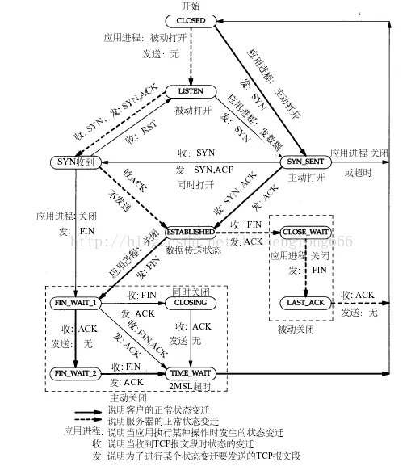
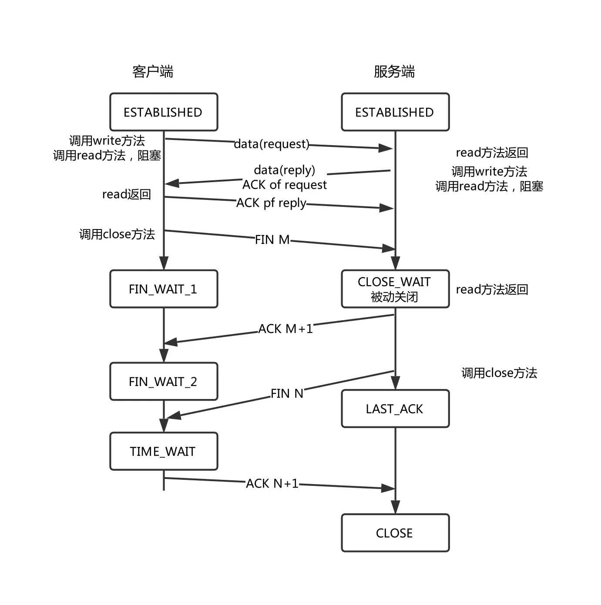

# 处理出现的CLOSE_WAIT状态

## 问题

先说一下问题的基本情况。在内网压测过程中发现压测机器人无法登录，但在外网跑了一天稳定性也没出现问题。

感觉很奇怪，终于有一天，内容日志中发现了下面一段

```
accept error: Too Many open files
```

看起来是文件描述符打开过多，一开始以为压测的人数太多了，超过了描述符数量，就调整人数以及通过ulimit 方式增加进程的文件描述符数量。结果治标不治本，在执行过多次机器人后，发现问题还是存在

随机通过下面一些命令查看打开的描述符
- lsof -p <进程号>  查看对应进程的文件描述符
- ss -tnae  查看socket的状态

发现有一堆socket处于CLOSE_WAIT状态.

随即找到TCP的状态机看看为啥出现这样的情况





根据上面的图可以知道，进入CLOSE_WAIT状态了之后，是需要进程主动调用close来关闭fd才能改变状态机的状态的。

翻阅代码，果然发现同事在处理连接断开的时候存在问题，没调用对应的close来关闭fd。

测试一下发现，只要是个链接，fd就会卡在CLOSE_WAIT状态，直到超过进程fd上限。调用close之后确实问题解决了。

## 外网为啥没问题？

在解决之后，突然想到为啥外网没事呢？ 理论上是一套代码，应该一定会卡在CLOSE_WAIT状态才对.

测试了一下，发现外网也存在这个情况，但CLOSE_WAIT状态的链接大概3分钟后就被清理掉了。
而且外网的进程可持有FD数量也比较大，所以才没出现无法登录的情况。

看来CLOSE_WAIT应该是有系统级别的清理方法作为最后的保障。

但查了一圈好像没人说过这个情况，看到一个稍微靠谱一点的说法是 TCP的 keep_alive机制

TCP keep_alive 是内核层面上的TCP保活机制，它会隔一段时间就侦测一下TCP链接是否还有效。通过一下命令可以看到对应的参数

```
$ cat /proc/sys/net/ipv4/tcp_keepalive_time  7200 
$ cat /proc/sys/net/ipv4/tcp_keepalive_intvl  75 
$ cat /proc/sys/net/ipv4/tcp_keepalive_probes  9
```
默认配置如上
- tcp_keepalive_time 7200 秒后发送一次侦测包
- tcp_keepalive_intvl 如果没回应则 75 秒后再发一次
- tcp_keepalive_probes 尝试9次没回应就断开连接

通过 ss -tnae 也能看到对应的连接上有一个timer ，表明下一次侦探包的时间

但稍微奇怪的是，我发现虽然外网的tcp_keepalive_time不是7200，但也是高达1200 .而CLOSE_WAIT状态大概200秒左右就被清理掉了，所以不能完全确定是TCP KEEP_ALIVE所造成的。

## 2023 - 09 - 26 更新

后续又调查了一下，虽然还是不能找到准确原因，但发现CLOSE_WAIT状态的清理可能和RST包有关，在客户端断开连接120秒后，因为服务器一直没下发FIN包，客户端发起RST强制中断了连接。

这个RST在服务器引擎中不知道怎么触发了Broken pipe操作，导致连接被清理掉了。

而内网开发的时候，因为服务器是搭建在windows10 的WSL2的虚拟机中，可能环境和真实的debian有出入，导致内网没触发 Broken pipe 所以没清理掉。

又尝试了一下 tcp_keepalive的行为，在debian上确实需要20分钟后才被清理。

## 引用
1. https://www.jianshu.com/p/94dff0f29218
2. https://www.jianshu.com/p/3c7a0771b67e
3. https://www.xiaolincoding.com/network/3_tcp/tcp_interview.html#%E6%9C%8D%E5%8A%A1%E5%99%A8%E5%87%BA%E7%8E%B0%E5%A4%A7%E9%87%8F-close-wait-%E7%8A%B6%E6%80%81%E7%9A%84%E5%8E%9F%E5%9B%A0%E6%9C%89%E5%93%AA%E4%BA%9B
4. https://zhuanlan.zhihu.com/p/578699402